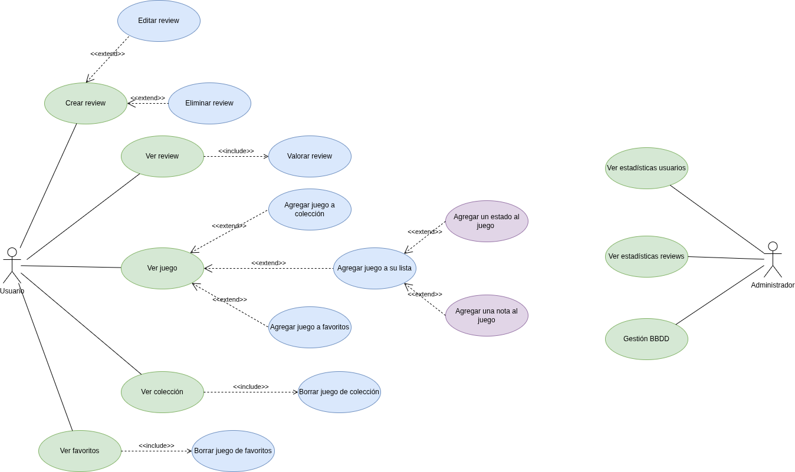
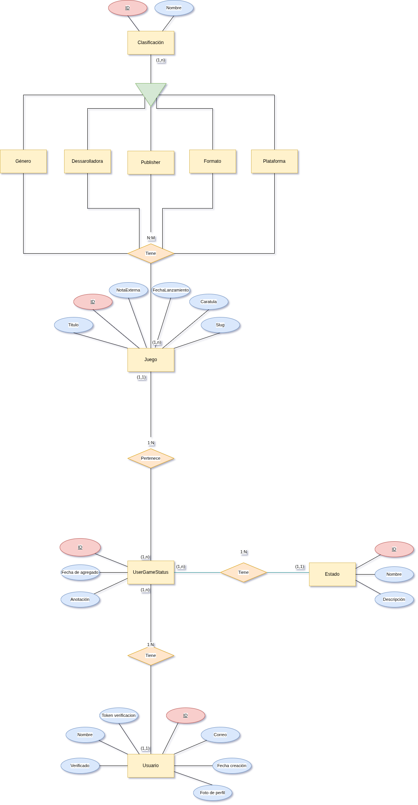
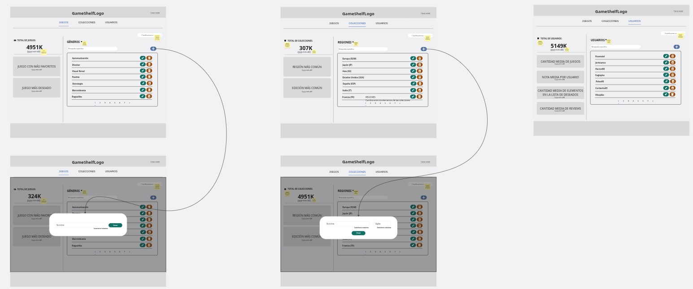

# GameShelf

  <strong>
    Autor: 
    
      <a href="https://github.com/nalleon" target="_blank" style="color: #688d7a; text-decoration: none;">Nabil L. A. @nalleon & Pedro M. E. @PeterMartEsc</a>
    
  </strong>

 

    

>    ___Organiza. Muestra. Encuentra.___

**_La documentacíon esta siendo migrada Zensical._**

 

## Índice
- [Descripción del proyecto](#descripción-del-proyecto--)
    - [Características principales](#características-principales-)
    - [Arquitectura y tecnologías](#arquitectura-y-tecnologías-️)
- [Diseño lógico](#diseño-lógico-)
    - [Diagrama de Casos de Uso](#diagrama-de-casos-de-uso-)
    - [Diagrama Entidad/Relación](#diagrama-entidadrelación-️)
        
    
            

                Tablas y Relaciones
            

        - [__Usuario__](#usuario)
        - [__Rol__](#rol)
        - [__Juego__](#juego)
        - [__Clasificación__](#clasificación)
        - [__Región__](#región)
        - [__Edición__](#edición)
        - [__Colección__](#colección)
        - [__JuegoColección__](#juegocolección)
        - [__Favorito__](#favorito)
        - [__Reseña__](#reseña)
        - [__FotoReseña__](#fotoreseña)
        - [__Lista de Deseados__](#lista-de-deseados)
        - [__NotaJuego__](#notajuego)
        - [__Estado__](#estado)
        - [__UsuarioJuegoEstado__](#usuariojuegoestado)

        

    - [Diagrama de Clases](#diagrama-de-clases-)
- [Diseño visual](#diseño-visual)
    - [Paleta de colores](#paleta-de-colores-)
    - [Wireframes](#wireframes-)
- [Instrucciones de instalación y uso](#instrucciones-de-instalación-y-uso-️)
    - [Documentación de la API](#documentación-de-la-api-)

***

 

## Descripción del proyecto

GameShelf es una aplicación diseñada y enfocado en ayudar a los jugadores a  organizar títulos de su colección actual así como encontrar futuras adquisiciones. Haciendo especial hincapíe en el formato (físico, digital), el tipo de edición (standard, day one, deluxe, coleccionista, etc) y la región (USA, EU, JP, CN, etc).

Esta aplicación esta dirigida a todo jugador que quiera tener un registro de su colección y que busquen una herramienta sencilla y eficaz para organizarlas y encontrar nuevos elementos para complementarlas.

### Características principales 

- Gestión detallada de versiones regionales de cada juego, permitiendo distinguir entre diferentes títulos según región (USA, EU, JP, CN, etc) y su plataforma (por ejemplo, Inazuma Eleven 3 para Nintendo DS en Japón vs. Nintendo 3DS en Occidente).

- Soporte para diferentes formatos de juegos: físico y digital.

- Gestión detallada del tipo de edición: standard, day one, deluxe, coleccionista, entre otras.

- Interfaz intuitiva y sencilla, pensada para jugadores que buscan una herramienta fácil de usar y eficaz.

- Posibilidad de buscar y encontrar nuevas adquisiciones para complementar y ampliar tu colección.

- Registro completo y actualizado de tu biblioteca personal de videojuegos.

- Visualización clara y organizada de la colección, con filtros para facilitar el acceso rápido a cualquier título.

- Soporte para múltiples plataformas y tipos de juegos, adaptándose a colecciones variadas.

## Diseño lógico

### Diagrama de Casos de Uso

    

### Diagrama Entidad/Relación  

A continuación se presenta el diseño inicial del modelo Entidad/Relación que servirá como base para la estructura de la base de datos en MySQL de GameShelf.

Este esquema refleja cómo se organizan y relacionan los distintos elementos clave del sistema, tales como videojuegos, ediciones, plataformas y regiones, asegurando una estructura coherente, escalable y fácil de mantener:

    

### Tablas y Relaciones

#### __Usuario__

| Campo                | Tipo     | Clave | Descripción                          |
| -------------------- | -------- | ----- | ------------------------------------ |
| `ID`                 | Entero   | PK    | Identificador único del usuario      |
| `Nombre`             | Texto    |       | Nombre visible del usuario           |
| `Correo`             | Texto    |       | Email del usuario                    |
| `Fecha_creación`     | Fecha    |       | Fecha en la que se creó el usuario   |
| `Verificado`         | Booleano |       | Indica si el usuario está verificado |
| `Token_verificación` | Texto    |       | Token para la verificación por email |
| `Foto_perfil`        | Imagen   |       | Ruta o URL de la imagen              |
| `Rol_ID`             | Entero   | FK    | Clave foránea al rol del usuario     |

|  Relaciones                                                                |
| --------------------------------------------------------------------------- |
| Un Usuario tiene un Rol.                                                    |
| Un Usuario tiene muchas Reseñas, Colecciones, Listas de Deseos y Favoritos. |

 

 

#### __Rol__

| Campo    | Tipo   | Clave | Descripción           |
| -------- | ------ | ----- | --------------------- |
| `ID`     | Entero | PK    | Identificador del rol |
| `Nombre` | Texto  |       | Nombre del rol        |

 

 

#### __Juego__

| Campo               | Tipo   | Clave | Descripción                        |
| ------------------- | ------ | ----- | ---------------------------------- |
| `ID`                | Entero | PK    | Identificador único del juego      |
| `Título`            | Texto  |       | Nombre del juego                   |
| `Carátula`          | Imagen |       | Imagen representativa del juego    |
| `Slug`              | Texto  |       | Identificador URL amigable         |
| `Fecha_lanzamiento` | Texto  |       | Fecha de lanzamiento al mercado    |
| `Nota_Metacritic`   | Float  |       | Puntuacion de metacritic del juego |

|  Relaciones                                                                                     |
| ------------------------------------------------------------------------------------------------ |
| Un juego puede tener muchas Reseñas.                                                             |
| Un juego aparece en múltiples Colecciones y Listas de Deseados.                                  |
| Un juego puede tener múltiples Clasificaciones como Género, Publisher, Formato, Plataforma, etc. |

 

 

#### __Clasificación__

| Campo    | Tipo   | Clave | Descripción                            |
| -------- | ------ | ----- | -------------------------------------- |
| `ID`     | Entero | PK    | Identificador del elemento de catálogo |
| `Nombre` | Texto  |       | Nombre visible del elemento            |

|  Relaciones                                                             |
| ------------------------------------------------------------------------ |
| De esta heredan: Género, Publisher, Desarrolladora, Formato, Plataforma. |
| Un Juego puede tener múltiples valores de estas categorías.              |
| Se usa también en elementos de Colección y Lista de Deseados.            |

 

 

#### __Región__

| Campo    | Tipo   | Clave | Descripción                    |
| -------- | ------ | ----- | ------------------------------ |
| `ID`     | Entero | PK    | Identificador único            |
| `Nombre` | Texto  |       | Nombre de la región            |
| `Siglas` | Texto  |       | Código abreviado (EU, JP, etc) |

|  Relaciones                                                                                  |
| --------------------------------------------------------------------------------------------- |
| Se utiliza en JuegoColección y Lista de Deseados para indicar versiones regionales de juegos. |

 

 

#### __Edición__

| Campo         | Tipo   | Clave | Descripción                |
| ------------- | ------ | ----- | -------------------------- |
| `ID`          | Entero | PK    | Identificador único        |
| `Nombre`      | Texto  |       | Nombre de la región        |
| `Descripción` | Texto  |       | Breve descripción del tipo |

|  Relaciones                                                                           |
| -------------------------------------------------------------------------------------- |
| Se utiliza en JuegoColección y Lista de Deseados para indicar ediciones de los juegos. |

 

 

#### __Colección__

| Campo        | Tipo   | Clave | Descripción                         |
| ------------ | ------ | ----- | ----------------------------------- |
| `ID`         | Entero | PK    | Identificador de la colección       |
| `Usuario_ID` | Entero | FK    | Usuario propietario de la colección |

|  Relaciones                                                       |
| ------------------------------------------------------------------ |
| Un usuario tiene una colección.                                    |
| Una colección contiene múltiples juegos mediante `JuegoColección`. |

 

 

#### __JuegoColección__

| Campo           | Tipo   | Clave | Descripción                                         |
| --------------- | ------ | ----- | --------------------------------------------------- |
| `ID`            | Entero | PK    | Identificador único del registro                    |
| `Colección_ID`  | Entero | FK    | Clave foránea a la colección                        |
| `Juego_ID`      | Entero | FK    | Clave foránea al juego                              |
| `Región_ID`     | Entero | FK    | Región específica del juego en esa colección        |
| `Formato_ID`    | Entero | FK    | Formato (Físico/Digital) del juego en esa colección |
| `Plataforma_ID` | Entero | FK    | Plataforma del juego en esa colección               |
| `Edicion_ID`    | Entero | FK    | Edicion del juego en esa colección                  |

|  Relaciones                                                    |
| --------------------------------------------------------------- |
| Tabla de la entidad intermedia N:M entre `Colección` y `Juego`. |
| Almacena detalles específicos del ejemplar del juego.           |

 

 

#### __Favorito__

| Campo        | Tipo   | Clave | Descripción                   |
| ------------ | ------ | ----- | ----------------------------- |
| `ID`         | Entero | PK    | Identificador del favorito    |
| `Usuario_ID` | Entero | FK    | Usuario que marcó el favorito |
| `Juego_ID`   | Entero | FK    | Juego marcado como favorito   |

|  Relaciones                                               |
| ---------------------------------------------------------- |
| Tabla de entidad intermedia N:M entre `Usuario` y `Juego`. |

 

 

#### __Reseña__

| Campo                 | Tipo de dato | Clave | Descripción                                       |
| --------------------- | ------------ | ----- | ------------------------------------------------- |
| `ID`                  | Entero       | PK    | Identificador único de la reseña                  |
| `Contenido`           | Texto        |       | Texto escrito por el usuario                      |
| `Fecha_creación`      | Fecha/Hora   |       | Fecha en la que se creó la reseña                 |
| `Fecha_actualización` | Fecha/Hora   |       | Fecha de la última modificación de la reseña      |
| `Usuario_ID`          | Entero       | FK    | Clave foránea al usuario que escribió la reseña   |
| `Juego_ID`            | Entero       | FK    | Clave foránea al juego al que pertenece la reseña |

|  Relaciones                                                                                  |
| --------------------------------------------------------------------------------------------- |
| Un Usuario puede crear varias Reseñas, pero cada Reseña pertenece a un único Usuario (1:N).   |
| Cada Reseña hace referencia a un único Juego, pero un Juego puede tener muchas Reseñas (1:N). |

 

 

#### __FotoReseña__

| Campo         | Tipo de dato | Clave | Descripción                                          |
| ------------- | ------------ | ----- | ---------------------------------------------------- |
| `ID`          | Entero       | PK    | Identificador único de la foto                       |
| `Ruta_imagen` | Texto        |       | Enlace o ruta al archivo de imagen                   |
| `Reseña_ID`   | Entero       | FK    | Clave foránea a la reseña a la que pertenece la foto |

|  Relaciones                                                                                 |
| -------------------------------------------------------------------------------------------- |
| Una reseña puede tener muchas fotos, pero esas fotos pertenecen a esa Reseña concreta (1:N). |

 
 

***

    

#### __Lista de Deseados__

| Campo            | Tipo   | Clave | Descripción                           |
| ---------------- | ------ | ----- | ------------------------------------- |
| `ID`             | Entero | PK    | Identificador                         |
| `Usuario_ID`     | Entero | FK    | Usuario dueño de esta entrada         |
| `Juego_ID`       | Entero | FK    | Juego deseado                         |
| `Región_ID`      | Entero | FK    | Región deseada del juego              |
| `Formato_ID`     | Entero | FK    | Formato deseado del juego             |
| `Plataforma_ID`  | Entero | FK    | Plataforma deseada del juego          |
| `Edicion_ID`     | Entero | FK    | Edicion deseada del juego             |
| `Prioridad`      | Entero |       | Nivel de prioridad (1-5, por ejemplo) |
| `Fecha_creación` | Fecha  |       | Fecha en la que se añadió             |
| `Anotación`      | Texto  |       | Nota personalizada del usuario        |

|  Relaciones                                                                 |
| ---------------------------------------------------------------------------- |
| N:M entre `Usuario` y `Juego`, con datos adicionales (formato, región, etc). |

 

 

#### __NotaJuego__

| Campo        | Tipo   | Clave | Descripción                                 |
| ------------ | ------ | ----- | ------------------------------------------- |
| `ID`         | Entero | PK    | Identificador único de la nota              |
| `Usuario_ID` | Entero | FK    | Usuario que asigna la nota                  |
| `Juego_ID`   | Entero | FK    | Juego al que se le asigna la nota           |
| `Valor`      | Float  |       | Nota asignada                               |
| `Fecha`      | Fecha  |       | Fecha en la que se creó o actualizó la nota |

|  Relaciones                                                                                  |
| --------------------------------------------------------------------------------------------- |
|  Un juego puede ser puntuado por varios usuarios (1:N). |
|  Un usuario puede puntuar varios juegos, pero esa nota concreta pertenece a un usuario y un juego en específico (1:N).|

 
 

***

    

#### __Estado__

| Campo         | Tipo   | Clave  | Descripción                                           |
| ------------- | ------ | ------ | ----------------------------------------------------- |
| `ID`          | Entero | PK     | Identificador único del estado                        |
| `Nombre`      | Texto  | UNIQUE | Nombre del estado: Planeado, Completado, Pausado etc. |
| `Descripción` | Texto  | UNIQUE | Descripción breve de para que es el estado            |

 

 

#### __UsuarioJuegoEstado__

| Campo            | Tipo   | Clave | Descripción                                             |
| ---------------- | ------ | ----- | ------------------------------------------------------- |
| `ID`             | Entero | PK    | Identificador único                                     |
| `Usuario_ID`     | Entero | FK    | Clave foránea al usuario                                |
| `Juego_ID`       | Entero | FK    | Clave foránea al juego                                  |
| `Estado_ID`      | Entero | FK    | Clave foránea a `EstadoJuego`                           |
| `Nota`           | Float  |       | Nota asignada                                           |
| `Anotación`      | Texto  |       | (Opcional) Comentario personal                          |
| `Fecha_agregado` | Fecha  |       | Fecha en la que el usuario añadió este juego a su lista |

|  Relaciones                                                                                  |
| --------------------------------------------------------------------------------------------- |
|   Un usuario puede tener muchos juegos en diferentes estados. |
|   Un juego puede estar en diferentes listas de distintos usuarios.|
| Cada entrada en la lista tiene un estado.|

 

### Diagrama de Clases 

WIP.

## Diseño visual 

### Paleta de colores 

Esta ha sido la selección principal de colores que compondran la estética de la aplicación:

    

 

### Wireframes

En cuanto a las decisiones de diseño para la aplicación se ha tomado el siguiente enfoque para la página de administración:

    

> [Click aquí para verlo en más detalle](./img/wf-admin.pdf)

***

 

## Instrucciones de instalación y uso
### Documentación de la API 

