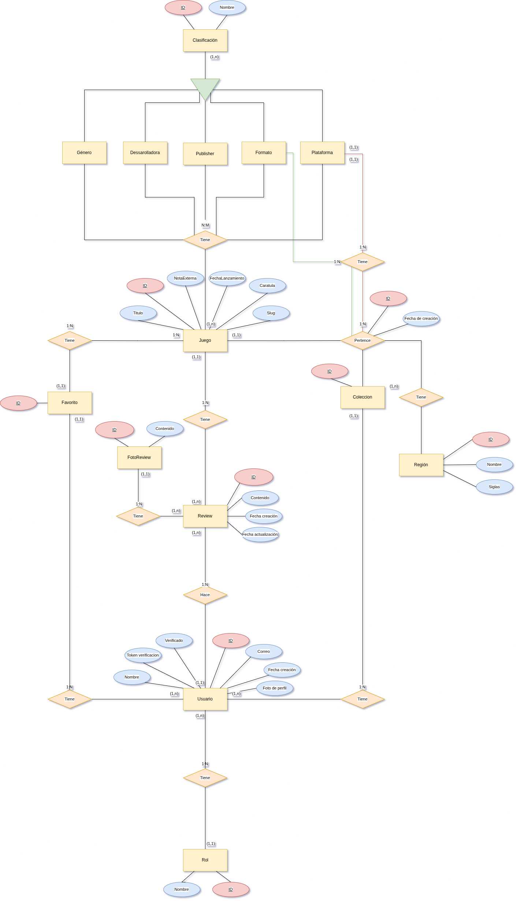
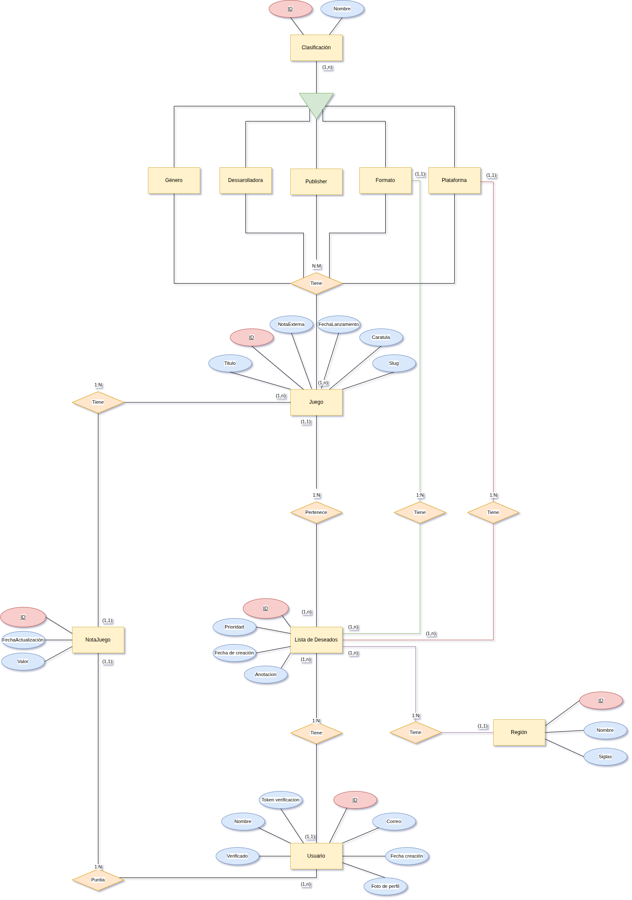
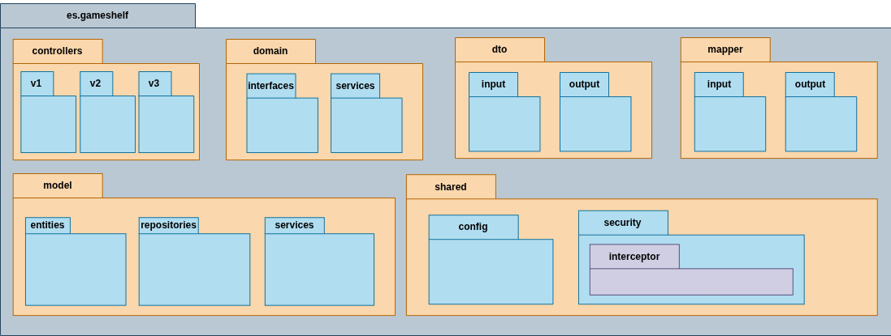

<div align="justify">

# GameShelf

<div align="right">
  <strong>
    Autor: 
    <span style="color: #688d7a;">
      <a href="https://github.com/nalleon" target="_blank" style="color: #688d7a; text-decoration: none;">Nabil L. A. @nalleon</a>
    </span>
  </strong>
</div>

<br>

<div align="center">
    

>    ___Organiza. Muestra. Encuentra.___

</div>


## Índice

- [Descripción del proyecto](#descripción-del-proyecto)
  - [Características principales](#características-principales)
  - [Arquitectura y tecnologías](#arquitectura-y-tecnologías)

- [Diseño lógico](#diseño-lógico)
  - [Diagrama de Casos de Uso](#diagrama-de-casos-de-uso)
  - [Diagrama Entidad/Relación](#diagrama-entidadrelación)
  - [Diagrama de Clases](#diagrama-de-clases)
  - [Diagrama de Paquetes](#diagrama-de-paquetes)

- [Diseño visual](#diseño-visual)
  - [Paleta de colores](#paleta-de-colores)
  - [Wireframes](#wireframes)

- [Instrucciones de instalación y uso](#instrucciones-de-instalación-y-uso)
    - [Documentación de la API](#documentación-de-la-api)
- [Roadmap](#roadmap)

***

<br>

## Descripción del proyecto  📝

GameShelf es una aplicación diseñada y enfocado en ayudar a los jugadores a  organizar títulos de su colección actual así como encontrar futuras adquisiciones. Haciendo especial hincapíe en el formato (físico, digital), el tipo de edición (standard, day one, deluxe, coleccionista, etc) y la región (USA, EU, JP, CN, etc).

Esta aplicación esta dirigida a todo jugador que quiera tener un registro de su colección y que busquen una herramienta sencilla y eficaz para organizarlas y encontrar nuevos elementos para complementarlas.


### Características principales 💡

- Gestión detallada de versiones regionales de cada juego, permitiendo distinguir entre diferentes títulos según región (USA, EU, JP, CN, etc) y su plataforma (por ejemplo, Inazuma Eleven 3 para Nintendo DS en Japón vs. Nintendo 3DS en Occidente).

- Soporte para diferentes formatos de juegos: físico y digital.

- Gestión detallada del tipo de edición: standard, day one, deluxe, coleccionista, entre otras.

- Interfaz intuitiva y sencilla, pensada para jugadores que buscan una herramienta fácil de usar y eficaz.

- Posibilidad de buscar y encontrar nuevas adquisiciones para complementar y ampliar tu colección.

- Registro completo y actualizado de tu biblioteca personal de videojuegos.

- Visualización clara y organizada de la colección, con filtros para facilitar el acceso rápido a cualquier título.

- Soporte para múltiples plataformas y tipos de juegos, adaptándose a colecciones variadas.


### Arquitectura y tecnologías 🖥️

Estas son las tecnologías que se utilizaran a lo largo del desarrollo de GameShelf:

- **Documentación:**
    - [Markdown](https://daringfireball.net/projects/markdown/) para la creación de documentos estructurados y legibles.
    - [Swagger UI](https://swagger.io/tools/swagger-ui/) como interfaz gráfica para la documentación de la API rest.
    - [SoapUI](https://www.soapui.org/) como interfaz gráfica para la documentación de los servicios SOAP.
    - [DrawIO](https://app.diagrams.net/) para el diseño de los diagramas.
    - [Miro](https://miro.com/diagramming/) para el diseño de la interfaz.

- **Gestión de Dependencias:**
    - [Maven](https://www.mysql.com/) para la gestión de dependencias y compilación del proyecto.

- **Bases de Datos y ORM:**
    - [MySQL](https://www.sqlite.org/index.html) como base de datos relacional.
    - [Hibernate/JPA](https://hibernate.org/) como ORM para la gestión de entidades relacionales.

- **Testing**
    - [JUnit5](https://junit.org/junit5/) para los tests unitarios.
    - [Mockito](https://site.mockito.org/) como biblioteca de mockeo para los tests.

- **Frameworks:**
    - [Spring Boot](https://spring.io/projects/spring-boot) como framework principal para el desarrollo de la aplicación del lado del server.
    - [Spring Data JPA](https://spring.io/projects/spring-data-jpa) para la interacción con bases de datos relacionales.
    - [React](https://es.react.dev/) para el cliente de administración web de la aplicación.
    - [React Native](https://reactnative.dev/) para el cliente de aplicación móvil.

- **Securización:**
    - [Spring Security](https://spring.io/projects/spring-security): como framework para la gestión de autenticación y autorización.
    - [JSON Web Tokens (JWT)](https://jwt.io/): para la creación y validación de tokens seguros para la autenticación de usuarios.
    - [Spring Security Test](https://docs.spring.io/spring-security/reference/testing/overview.html): para facilitar la creación de pruebas relacionadas con la seguridad.


- **Despliegue:**
    - [Docker](https://www.docker.com/) para la creación de contenedores y despliegue del proyecto en diferentes entornos.

- **APIs:**
    - [RAWGApi](https://rawg.io/apidocs) para obtener los videojuegos. 
    - [eBay](https://developer.ebay.com/api-docs/static/gs_ebay-rest-getting-started-landing.html) para las búsquedas de nuevos elementos para la colección y estadísticas/comparativas de precios. 
    - [Mercari](https://api.mercari-shops.com/docs/index.html) para las búsquedas de nuevos elementos para la colección y estadísticas/comparativas de precios.

## Diseño lógico 💾

### Diagrama de Casos de Uso 🧭

WIP.

### Diagrama Entidad/Relación 🗃️    

A continuación se presenta el diseño inicial del modelo Entidad/Relación que servirá como base para la estructura de la base de datos en MySQL de GameShelf.


Este esquema refleja cómo se organizan y relacionan los distintos elementos clave del sistema, tales como videojuegos, ediciones, plataformas y regiones, asegurando una estructura coherente, escalable y fácil de mantener:

<div align="center">
    
</div>

### Tablas y Relaciones

#### __Usuario__

| Campo              | Tipo      | Clave | Descripción                          |
| ------------------ | --------- | ----- | ------------------------------------ |
| `ID`               | Entero    | PK    | Identificador único del usuario      |
| `Nombre`           | Texto     |       | Nombre visible del usuario           |
| `Correo`           | Texto     |       | Email del usuario                    |
| `Fecha_creación`   | Fecha     |       | Fecha en la que se creó el usuario   |
| `Verificado`       | Booleano  |       | Indica si el usuario está verificado |
| `Token_verificación` | Texto   |       | Token para la verificación por email |
| `Foto_perfil`      | Imagen    |       | Ruta o URL de la imagen              |
| `Rol_ID`           | Entero    | FK    | Clave foránea al rol del usuario     |

***

#### 🔗 Relaciones

- Un Usuario tiene un Rol.  
- Un Usuario tiene muchas Reviews, Colecciones, Listas de Deseos y Favoritos.


<br>


#### __Rol__

| Campo   | Tipo   | Clave | Descripción           |
| ------- | ------ | ----- | --------------------- |
| `ID`    | Entero | PK    | Identificador del rol |
| `Nombre`| Texto  |       | Nombre del rol        |


<br>


#### __Juego__

| Campo     | Tipo   | Clave | Descripción                      |
| --------- | ------ | ----- | -------------------------------- |
| `ID`      | Entero | PK    | Identificador único del juego    |
| `Título`  | Texto  |       | Nombre del juego                 |
| `Carátula`| Imagen |       | Imagen representativa del juego  |
| `Slug`    | Texto  |       | Identificador URL amigable       |
| `Fecha_lanzamiento`    | Texto  |       | Fecha de lanzamiento al mercado       |
| `Nota_Metacritic`    | Float  |       | Puntuacion de metacritic del juego       |


***

#### 🔗 Relaciones

- Un juego puede tener muchas Reviews.
- Un juego aparece en múltiples Colecciones y Listas de Deseados.
- Un juego puede tener múltiples Clasificaciones como Género, Publisher, Formato, Plataforma, etc.


<br>


#### __Clasificación (Abstracta)__

| Campo  | Tipo   | Clave | Descripción                            |
| ------ | ------ | ----- | -------------------------------------- |
| `ID`   | Entero | PK    | Identificador del elemento de catálogo |
| `Nombre`| Texto |       | Nombre visible del elemento            |

***

#### 🔗 Relaciones

- De esta heredan: Género, Publisher, Desarrolladora, Formato, Plataforma.
- Un Juego puede tener múltiples valores de estas categorías.
- Se usa también en elementos de Colección y Lista de Deseados.


<br>


#### __Región__

| Campo   | Tipo   | Clave | Descripción            |
| ------- | ------ | ----- | ---------------------- |
| `ID`    | Entero | PK    | Identificador único    |
| `Nombre`| Texto  |       | Nombre de la región    |
| `Siglas`| Texto  |       | Código abreviado (EU, JP, etc) |

***

#### 🔗 Relaciones

- Se utiliza en GameCollection y Lista de Deseados para indicar versiones regionales de juegos.


<br>


#### __Colección__

| Campo         | Tipo   | Clave | Descripción                         |
| ------------- | ------ | ----- | ----------------------------------- |
| `ID`          | Entero | PK    | Identificador de la colección       |
| `Usuario_ID`  | Entero | FK    | Usuario propietario de la colección |

***

#### 🔗 Relaciones

- Un usuario tiene muchas colecciones.
- Una colección contiene múltiples juegos mediante `GameCollection`.


<br>


#### __GameCollection__

| Campo           | Tipo    | Clave | Descripción                                              |
|-----------------|---------|-------|----------------------------------------------------------|
| `ID`            | Entero  | PK    | Identificador único del registro                         |
| `Colección_ID`  | Entero  | FK    | Clave foránea a la colección                             |
| `Juego_ID`      | Entero  | FK    | Clave foránea al juego                                   |
| `Región_ID`     | Entero  | FK    | Región específica del juego en esa colección             |
| `Formato_ID`    | Entero  | FK    | Formato (Físico/Digital) del juego en esa colección      |
| `Plataforma_ID` | Entero  | FK    | Plataforma del juego en esa colección                    |

***

#### 🔗 Relaciones

- Tabla intermedia N:M entre `Colección` y `Juego`.
- Almacena detalles específicos del ejemplar del juego.


<br>


#### __Favorito__

| Campo        | Tipo   | Clave | Descripción                    |
| ------------ | ------ | ----- | ------------------------------ |
| `ID`         | Entero | PK    | Identificador del favorito     |
| `Usuario_ID` | Entero | FK    | Usuario que marcó el favorito  |
| `Juego_ID`   | Entero | FK    | Juego marcado como favorito    |

***

#### 🔗 Relaciones

- Tabla intermedia N:M entre `Usuario` y `Juego`.

#### __Review__

| Campo                 | Tipo de dato | Clave | Descripción                                       |
| --------------------- | ------------ | ----- | ------------------------------------------------- |
| `ID`                  | Entero       | PK    | Identificador único de la review                  |
| `Contenido`           | Texto        |       | Texto escrito por el usuario                      |
| `Fecha_creación`      | Fecha/Hora   |       | Fecha en la que se creó la review                 |
| `Fecha_actualización` | Fecha/Hora   |       | Fecha de la última modificación de la review      |
| `Usuario_ID`          | Entero       | FK    | Clave foránea al usuario que escribió la review   |
| `Juego_ID`            | Entero       | FK    | Clave foránea al juego al que pertenece la review |

***

#### 🔗 Relaciones

- Un Usuario puede crear varias Reviews, pero cada Review pertenece a un único Usuario (1:N).

- Cada Review hace referencia a un único Juego, pero un Juego puede tener muchas Reviews (1:N).

<br>


#### __FotoReview__

| Campo         | Tipo de dato | Clave | Descripción                                          |
| ------------- | ------------ | ----- | ---------------------------------------------------- |
| `ID`          | Entero       | PK    | Identificador único de la foto                       |
| `Ruta_imagen` | Texto (URL)  |       | Enlace o ruta al archivo de imagen                   |
| `Review_ID`   | Entero       | FK    | Clave foránea a la review a la que pertenece la foto |

***

#### 🔗 Relaciones

- Una review puede tener muchas fotos, pero esas fotos pertenecen a esa Review concreta (1:N).

<br>

***

### Añadidos complementarios

<div align="center">
    
</div>


#### __Lista de Deseados__

| Campo             | Tipo   | Clave | Descripción                            |
| ----------------- | ------ | ----- | -------------------------------------- |
| `ID`              | Entero | PK    | Identificador                          |
| `Usuario_ID`      | Entero | FK    | Usuario dueño de esta entrada          |
| `Juego_ID`        | Entero | FK    | Juego deseado                          |
| `Región_ID`       | Entero | FK    | Región deseada del juego               |
| `Formato_ID`      | Entero | FK    | Formato deseado del juego              |
| `Plataforma_ID`   | Entero | FK    | Plataforma deseada del juego           |
| `Prioridad`       | Entero |       | Nivel de prioridad (1-5, por ejemplo)  |
| `Fecha_creación`  | Fecha  |       | Fecha en la que se añadió              |
| `Anotación`       | Texto  |       | Nota personalizada del usuario         |

***

#### 🔗 Relaciones

- N:M entre `Usuario` y `Juego`, con datos adicionales (formato, región, etc).


<br>

#### __NotaJuego__

| Campo        | Tipo   | Clave | Descripción                                           |
| ------------ | ------ | ----- | ----------------------------------------------------- |
| `ID`         | Entero | PK    | Identificador único de la nota                        |
| `Usuario_ID` | Entero | FK    | Usuario que asigna la nota                            |
| `Juego_ID`   | Entero | FK    | Juego al que se le asigna la nota                     |
| `Valor`      | Float  |       | Nota asignada |
| `Fecha`      | Fecha  |       | Fecha en la que se creó o actualizó la nota           |

***

#### 🔗 Relaciones

- Un usuario puede puntuar varios juegos, pero cada nota pertenece a un único usuario (1:N).
- Un juego puede ser puntuado por varios usuarios (1:N).


<br>


### Diagrama de Clases 🧱 

WIP.
### Diagrama de Paquetes 📦

Tras analizar la complejidad del proyecto GameShelf, se ha decidido utilizar una estructura basada en el patrón Modelo-Vista-Controlador (MVC), ya que permite organizar el código de forma clara y facilita su mantenimiento.

Sin embargo, para lograr una mayor flexibilidad y separar mejor la lógica del negocio de la infraestructura, también se integran elementos de la arquitectura hexagonal. Esta combinación permite que la aplicación pueda trabajar con distintas tecnologías (como bases de datos relacionales o no relacionales) sin modificar el núcleo del sistema. Aislando así la lógica de negocio y haciendola independiente de cómo o dónde se almacenan los datos, lo que facilita futuras integraciones o cambios tecnológicos.

<div align="center">
    
</div>


## Diseño visual 

### Paleta de colores 🎨 

Esta ha sido la selección principal de colores que compondran la estética de la aplicación:


<div align="center">
    
</div>


### Wireframes 📱

WIP.


***

<br>


## Instrucciones de instalación y uso ⚙️
### Documentación de la API 📑

#### Servicios REST
Toda la documentación de estos endpoints de la API rest están disponibles en Swagger através de la siguiente URL: http://localhost:8080/swagger-ui/index.html.

Para acceder a ella, simplemente compila y ejecuta el proyecto con el siguiente comando en la terminal:

```bash
mvn spring-boot:run
```

#### Servicios SOAP
La documentación completa de los servicios SOAP puede consultarse a través de sus respectivos WSDLs, como por ejemplo puede ser: {http://impl.soap.service.gameshelf.es/}GameSoapService para los juegos. 

Una vez hecho el comando anterior, se debe de ir a esta URL: http://localhost:8080/services


```bash
mvn spring-boot:run
```
> Se recomienda el uso de SoapUI para intereaccionar. 

## Roadmap 🛤️

- Implementacion de una lista de deseos
- Implementación de búsqueda y pricing en Ebay

</div>
