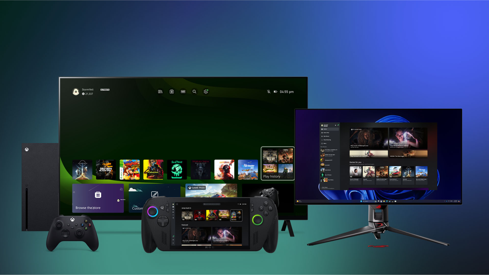
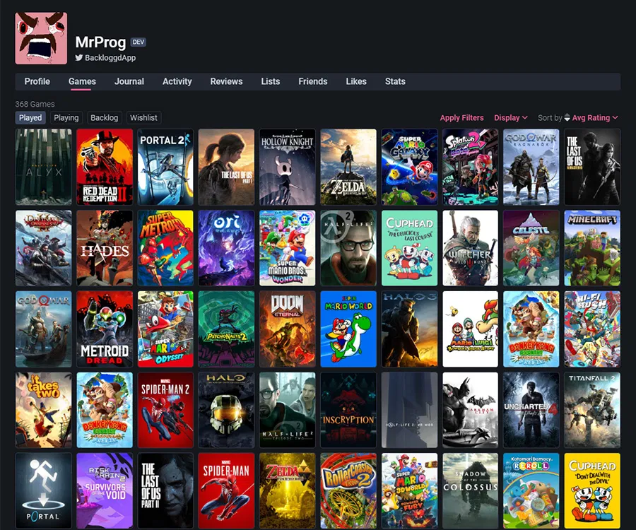

# Origen, contextualización y justificación del proyecto

Nuestra idea del proyecto es crear una aplicación destinada al coleccionismo de videojuegos, es decir, que un usuario pueda llevar un registro de juegos que tiene en su colección así como poder crear publicaciones alrededor de estos o comentar en otras. Esta función añade un componente social que puede ayudar a los usuarios a descubrir nuevos juegos que quieran tanto jugar como acabar añadiendo a su colección.

<figure markdown="span">

</figure>

  
Créditos de la imagen

  <ul>
    <li>Freepik</li>
  </ul>

---

La idea nos surgió tras ya que es un ámbito en el que ambos integrantes del equipo compartimos este hobby. Lo vimos adecuado como proyecto, ya que nos daba la libertad de abarcar un tema que realmente nos apasiona. Además, creemos que trabajar en algo relacionado con nuestra afición nos permite aportar creatividad, dedicación y un mayor nivel de detalle.

Tras investigar, identificamos la necesidad de que no existe una distinción como tal de las ediciones de los juegos basadas en la región en webs que ofrecen funcionalidades parecidas, ya que aunque actualmente suelen ser diferencias mínimas más allá de una portada distinta en la edición física, si nos enfocamos al coleccionismo si que es una parte clave para el usuario y cuando son juegos pertenecen a generaciones de consolas anteriores a la octava (2011-2020). Además, otro punto importante es el valor coleccionista dependiendo también de la plataforma, ya que servicios similares suelen agrupar el mismo juego si no hay una diferencia como ser una edición coleccionista (y aún así se agrupa la versión para PC con la XBOX por ejemplo).

<figure markdown="span">

</figure>

  
Créditos de la imagen

  <ul>
    <li> Dean Shimabukuro</li>
    <li> Product Marketing Manager</li>
    <li> Xbox Services Marketing</li>

  </ul>

---

Una de las principales alternativas actuales es [Backloggd](https://backloggd.com/), una plataforma que, si bien permite registrar juegos y compartir opiniones, no contempla aspectos esenciales para el coleccionismo, como la diferenciación por regiones, ediciones físicas específicas o formato. Además, carece de una versión móvil nativa, lo que limita su accesibilidad y usabilidad en comparación con nuestra propuesta, que nace con un enfoque multiplataforma y especializado en los matices que realmente valoran los coleccionistas.

<figure markdown="span">

</figure>

  
Créditos de la imagen

  <ul>
    <li> Backloggd </li>
  </ul>

