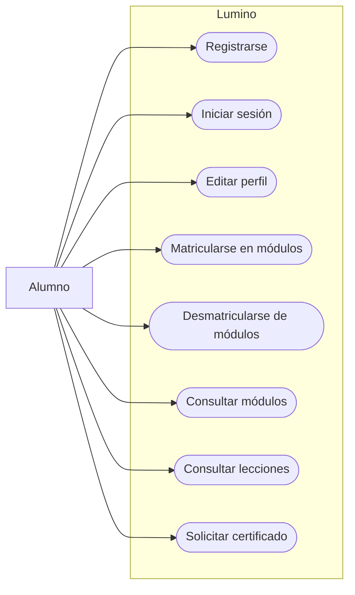
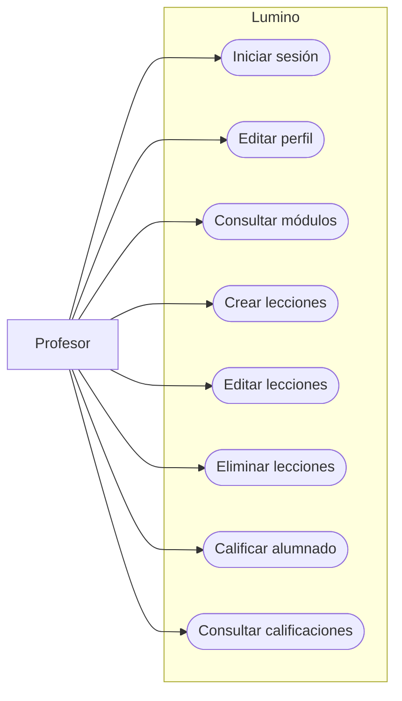

# Requisitos del proyecto

## Requisitos funcionales

Los requisitos funcionales describen las funcionalidades principales que debe ofrecer la aplicación **Lumino** como plataforma de gestión de formación online:

- Registro y autenticación de usuarios, diferenciando entre alumnado y profesorado.
- Gestión de perfiles de usuario con información personal, biografía y avatar.
- Matriculación y desmatriculación del alumnado en los módulos disponibles.
- Creación, edición y eliminación de lecciones asociadas a cada módulo.
- Visualización de los contenidos de las lecciones en formato Markdown.
- Asignación y gestión de calificaciones del alumnado por parte del profesorado.
- Consulta de notas por parte del alumnado.
- Solicitud y generación automática de certificados de calificaciones en formato PDF.
- Envío de mensajes de confirmación tras la realización de acciones relevantes.

---

## Requisitos no funcionales

Los requisitos no funcionales definen las características de calidad y comportamiento del sistema:

- **Rendimiento:** el sistema debe ofrecer tiempos de respuesta adecuados ante las acciones del usuario.
- **Seguridad:** el acceso a las funcionalidades debe estar restringido según el rol del usuario.
- **Usabilidad:** la interfaz debe ser clara, intuitiva y fácil de usar.
- **Escalabilidad:** la aplicación debe permitir el crecimiento del número de usuarios y contenidos.
- **Mantenibilidad:** el código debe seguir buenas prácticas que faciliten su mantenimiento y evolución.
- **Internacionalización:** el sistema debe soportar al menos los idiomas español e inglés.

---

## Restricciones

Las restricciones establecen las condiciones técnicas y organizativas que afectan al desarrollo del proyecto:

- La aplicación debe desarrollarse utilizando el framework **Django**.
- El idioma por defecto del proyecto debe ser inglés.
- Se deben utilizar librerías y herramientas específicas como Django Bootstrap, Sorl Thumbnail y Django-RQ.
- El sistema requiere el uso de Redis para la gestión de tareas en segundo plano.
- La estructura del proyecto y las aplicaciones están previamente definidas.
- El desarrollo debe ajustarse a los requisitos académicos del proyecto.

---

## Casos de uso

### Alumno

---

### Profesor    

