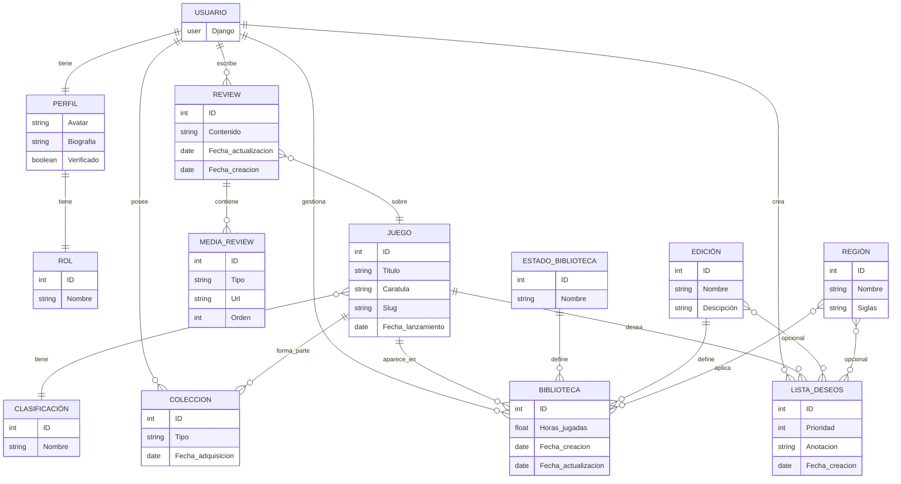

# Diseño

## Arquitectura del sistema

## Definición de la estructura del proyecto y base de datos

### Diagrama de Casos de Uso

### Diagrama de Entidad/Relación

### Diagrama de Clases

## API

### Endpoints

---

## Diseño de interfaz

### Principios del diseño

### Paleta de colores

### Vistas
#### Wireframe
#### MockUp