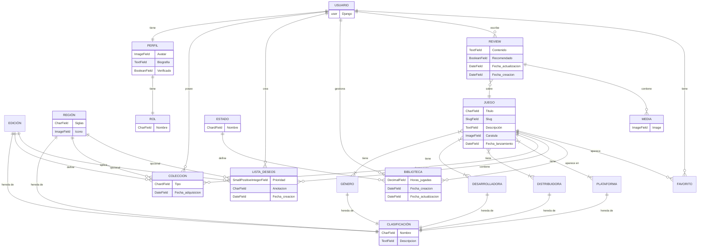

# Diseño

## Arquitectura del sistema

## Definición de la estructura del proyecto y base de datos

### Diagrama de Casos de Uso

### Diagrama de Entidad/Relación

### Diagrama de Clases

## API

### Endpoints

---

## Diseño de interfaz

### Principios del diseño

### Paleta de colores

<figure markdown="span">

  <figcaption>
        Paleta de colores escogida en [ColorMind](http://colormind.io/)
  </figcaption>

</figure>

### Vistas

#### Mapa de Navegación

El mapa de navegación fue un diseño inicial sencillo para plantear las funciones de la aplicacion web.

#### Sketch

En cuanto al skecth, hemos hecho un boceto a mano alzada, y ha quedado de la siguiente manera:

#### Wireframe

El Wireframe de la aplicación lo hemos realizado con [Moqups](moqups.com/es).

En esta etapa del diseño decidimos añadir una pantalla más que en el sketch para detallar la aplicación un poco más, así que obtenemos un total de 4 pantallas (register, login (autenticación), home y pantalla de detalles de un juego).

#### MockUp y Prototipo

Para llevar a cabo tanto el mockup como el prototipo hemos utilizado [Penpot](https://penpot.app/).

##### Mockup

##### Prototipo

