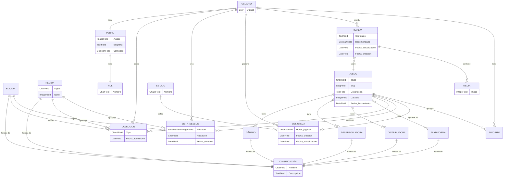

# Diseño

## :lucide-pyramid: Arquitectura del sistema

> Definición de la arquitectura del sistema

## :lucide-chart-network: Definición de la estructura del proyecto y base de datos

### Diagrama de Casos de Uso

> Diagrama Casos de Uso

### Diagrama de Entidad/Relación

### Diagrama de Clases

> Diagrama de Clases

## :lucide-braces: API

### Endpoints

- `/api/admin/`: url para la vista de administración que viene por defecto en Django

- `/api/schema/`

- `/api/docs/`: url para comprobar todos los endpoints de la API mediante la librería de Swagger

- `/api/auth/`

- `/api/users/`

- `/api/games/`
    - `/api/games/`: listado de todos los videojuegos
    - `/api/games/add/`: añadir uno videojuego nuevo
    - `/api/games/<int:pk_game>/edit/`: edita un videojuego existente
    - `/api/games/<int:pk_game>/delete/`: borra un videojuego existente

- `/api/reviews/`
    - `/api/reviews/`: listado de todas las reviews
    - `/api/reviews/add/`: añadir una review nueva
    - `/api/reviews/<int:pk_review>/edit/`: edita una review existente
    - `/api/reviews/<int:pk_review>/delete/`: borra una review existente

- `/api/medias/`
    - `/api/medias/`: listado de todas las medias
    - `/api/medias/add/`: añadir una media nueva
    - `/api/medias/<int:pk_media>/edit/`: edita una media existente
    - `/api/medias/<int:pk_media>/delete/`: borra una media existente

- `/api/favorites/`
    - `/api/favorites/`: listado de todos los favoritos
    - `/api/favorites/add/`: añadir un favorito nuevo
    - `/api/favorites/self-add/`: añadir un favorito a la lista del propio usuario
    - `/api/favorites/<int:pk_favorite>/edit/`: edita un favorito existente
    - `/api/favorites/<int:pk_favorite>/delete/`: borra un favorito existente

- `/api/platforms/`
    - `/api/platforms/`: listado de todas las plataformas
    - `/api/platforms/add/`: añadir una plataforma nueva
    - `/api/platforms/<int:pk_platform>/edit/`: edita una plataforma existente
    - `/api/platforms/<int:pk_platform>/delete/`: borra una plataforma existente

- `/api/genres/`
    - `/api/genres/`: listado de todos los géneros de videojuegos
    - `/api/genres/add/`: añadir un género de videojuego
    - `/api/genres/<int:pk_genre>/edit/`: edita un género existente
    - `/api/genres/<int:pk_genre>/delete/`: borra un género existente

- `/api/developers/`
    - `/api/developers/`
    - `/api/developers/`: listado de todos los desarrolladores de videojuegos
    - `/api/developers/add/`: añadir un desarrolladores de videojuegos
    - `/api/developers/<int:pk_developer>/edit/`: edita un desarrollador existente
    - `/api/developers/<int:pk_developer>/delete/`: borra un desarrollador existente

- `/api/publishers/`
    - `/api/publishers/`
    - `/api/publishers/`: listado de todos los publishers de videojuegos
    - `/api/publishers/add/`: añadir un publishers de videojuegos
    - `/api/publishers/<int:pk_publisher>/edit/`: edita un publishers existente
    - `/api/publishers/<int:pk_publisher>/delete/`: borra un publishers existente

- `/api/editions/`
    - `/api/editions/`
    - `/api/editions/`: listado de todas las ediciones de videojuegos
    - `/api/editions/add/`: añadir una edición de videojuego
    - `/api/editions/<int:pk_edition>/edit/`: edita una edición existente
    - `/api/editions/<int:pk_edition>/delete/`: borra una edición existente

- `/api/regions/`
    - `/api/regions/`
    - `/api/regions/`: listado de todas las regiones de videojuegos
    - `/api/regions/add/`: añadir una region de videojuego
    - `/api/regions/<int:pk_region>/edit/`: edita una region existente
    - `/api/regions/<int:pk_region>/delete/`: borra una region existente

- `/api/libraries/`
    - `/api/libraries/`
    - `/api/libraries/`: listado de todos los item de bibliotecas
    - `/api/libraries/add/`: añadir un item de bibliotecas
    - `/api/libraries/<int:pk_library_item>/edit/`: edita un item de bibliotecas
    - `/api/libraries/<int:pk_library_item>/delete/`: borra un item de bibliotecas

- `/api/collections/`
    - `/api/collections/`
    - `/api/collections/`: listado de todos los items de colección
    - `/api/collections/add/`: añadir un item de colección
    - `/api/collections/self-add/`: añadir un item a la colección del propio usuario
    - `/api/collections/<int:pk_collection_item>/edit/`: editar un item de colección
    - `/api/collections/<int:pk_collection_item>/delete/`: borra un item de colección

- `/api/wishlists/`
    - `/api/wishlists/`
    - `/api/wishlists/`: listado de todos los items de wishlists
    - `/api/wishlists/add/`: añadir un item de wishlist
    - `/api/wishlists/self-add/`: añadir un item a la wishlist del propio usuario
    - `/api/wishlists/<int:pk_wishlist_item>/edit/`: editar un item de wishlist
    - `/api/wishlists/<int:pk_wishlist_item>/delete/`: borra un item de wishlist
---

## :lucide-paintbrush: Diseño de interfaz

### Principios del diseño

### Paleta de colores

<figure markdown="span">

  <figcaption>
        Paleta de colores escogida en [ColorMind](http://colormind.io/)
  </figcaption>

</figure>

### Vistas

#### Mapa de Navegación

El mapa de navegación fue un diseño inicial sencillo para plantear las funciones de la aplicacion web.

#### Sketch

En cuanto al skecth, hemos hecho un boceto a mano alzada, y ha quedado de la siguiente manera:

#### Wireframe

El Wireframe de la aplicación lo hemos realizado con [Moqups](moqups.com/es).

En esta etapa del diseño decidimos añadir una pantalla más que en el sketch para detallar la aplicación un poco más, así que obtenemos un total de 4 pantallas (register, login (autenticación), home y pantalla de detalles de un juego).

#### MockUp y Prototipo

Para llevar a cabo tanto el mockup como el prototipo hemos utilizado [Penpot](https://penpot.app/).

##### Mockup

##### Prototipo

