# Diseño

## :lucide-pyramid: Arquitectura del sistema

!!! success "Visión general"
    GameShelf está diseñado como una aplicación web basada en **VUE** y **Django**, siguiendo una arquitectura clara, modular y escalable.

-    :lucide-globe: **Capa de presentación**  

     ---

     Interfaz web accesible desde el navegador, construida con VUE y TailwindCSS.

-    :lucide-cpu: **Capa de aplicación**  

     ---

     Lógica de negocio implementada mediante vistas, formularios y servicios de Django.

-    :lucide-database: **Capa de datos**  

     ---

     Persistencia de información mediante Django ORM y base de datos relacional.

-    :lucide-server: **Servicios auxiliares**  

     ---

     Procesamiento en segundo plano y envío de correos mediante Redis y Django-RQ.

### Esquema general de la arquitectura

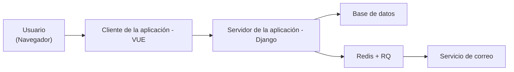

## :lucide-chart-network: Definición de la estructura del proyecto y base de datos

!!! info "División de los diagramas"
    Para facilitar la lectura y comprensión de la estructura, se optó por dividir tanto el diagrama E/R como el de clases en tres módulos principales para poder ver las relaciones principales sin saturar la visualización. 
    
    Estos módulos son los siguientes:

     * `Usuarios y perfiles` – Gestión de usuarios, perfiles, roles y favoritos.
     * `Juegos y clasificación` – Juegos, géneros, desarrolladoras, distribuidoras, plataformas, regiones y ediciones.
     * `Colección, lista de deseos y reviews` – Colecciones del usuario, listas de deseos, biblioteca y reseñas.
---

!!! warning "Consecuencias de la división"
    Esto solo afecta a la visualización de la documentación, **NO** influye en el diseño final de la aplicación.

### Diagrama de Casos de Uso

---

- :lucide-user: Registrarse
    - Actor: Usuario SIN privilegios
    - Descripción: Permite crear una cuenta en el sistema
    - Dependencias: Ninguna

- :lucide-user: Iniciar sesión
    - Actor: Usuario SIN privilegios
    - Descripción: Acceder a la cuenta creada
    - Dependencias: Ninguna

- :lucide-user: Ver perfil
    - Actor: Usuario SIN privilegios
    - Descripción: Consultar información de su perfil
    - Dependencias: Ninguna

- :lucide-user: Actualizar perfil
    - Actor: Usuario SIN privilegios
    - Descripción: Modificar sus datos personales
    - Dependencias: Depende de Ver perfil

- :lucide-gamepad: Ver juego
    - Actor: Usuario SIN privilegios
    - Descripción: Consultar la información de un juego
    - Dependencias: Ninguna

- :lucide-star: Marcar favorito
    - Actor: Usuario SIN privilegios
    - Descripción: Añadir un juego a favoritos
    - Dependencias: Depende de Ver juego

- :lucide-archive: Añadir a biblioteca
    - Actor: Usuario SIN privilegios
    - Descripción: Registrar que ha jugado/jugará el juego y sus horas jugadas
    - Dependencias: Depende de Ver juego

- :lucide-archive: Añadir a colección
    - Actor: Usuario SIN privilegios
    - Descripción: Incluir un juego dentro de su colección
    - Dependencias: Depende de Ver juego

- :lucide-edit: Añadir una reseña
    - Actor: Usuario SIN privilegios
    - Descripción: Escribir una reseña sobre un juego
    - Dependencias: Depende de Ver juego

- :lucide-edit: Editar una reseña
    - Actor: Usuario SIN privilegios
    - Descripción: Escribir una reseña sobre un juego
    - Dependencias: Depende de Añadir reseñar (_que sea del **propio usuario**_)

- :lucide-heart: Añadir a lista de deseos
    - Actor: Usuario SIN privilegios
    - Descripción: Añadir el juego a su lista de deseados
    - Dependencias: Depende de Ver juego

- :lucide-heart: Editar lista de deseos
    - Actor: Usuario SIN privilegios
    - Descripción: Añadir el juego a su lista de deseados
    - Dependencias: Depende de Añadir a lista de deseos (_que sea del **propio usuario**_)
    

---

- :lucide-gamepad: Crear juego
    - Actor: Usuario CON privilegios
    - Descripción: Crear un juego
    - Dependencias: Ninguna

- :lucide-gamepad: Editar juego
    - Actor: Usuario CON privilegios
    - Descripción: Editar un juego
    - Dependencias: Ninguna

- :lucide-gamepad: Editar juego
    - Actor: Usuario CON privilegios
    - Descripción: Editar un juego
    - Dependencias: Ninguna

### Diagrama de Entidad/Relación

#### :lucide-users: Usuarios y Perfiles
---

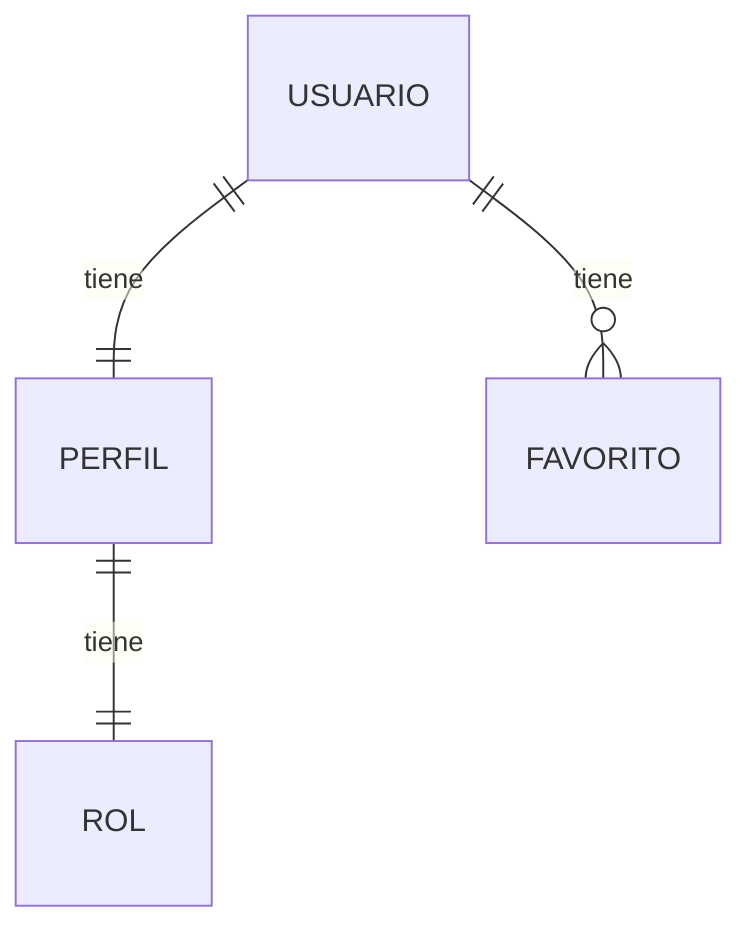

 

#### :lucide-gamepad: Juegos y Clasificación

---

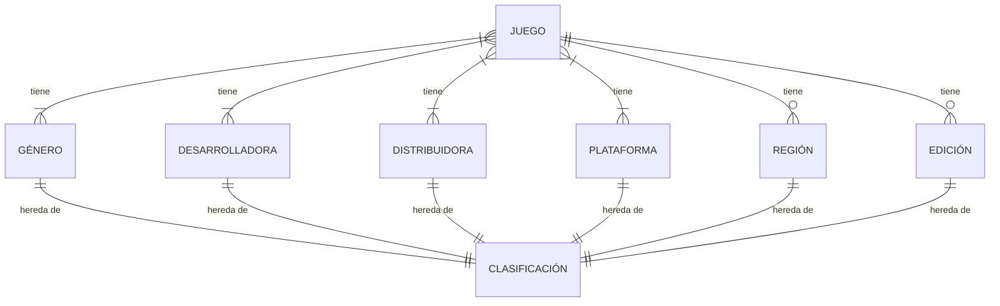

 

#### :lucide-archive: Colección, Lista de Deseos y Reviews
---

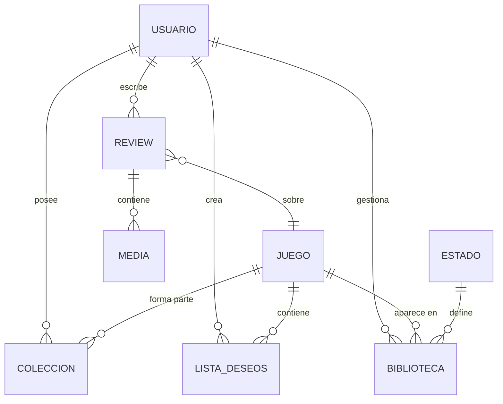

 

### Diagrama de Clases

#### :lucide-users: Usuarios y Perfiles

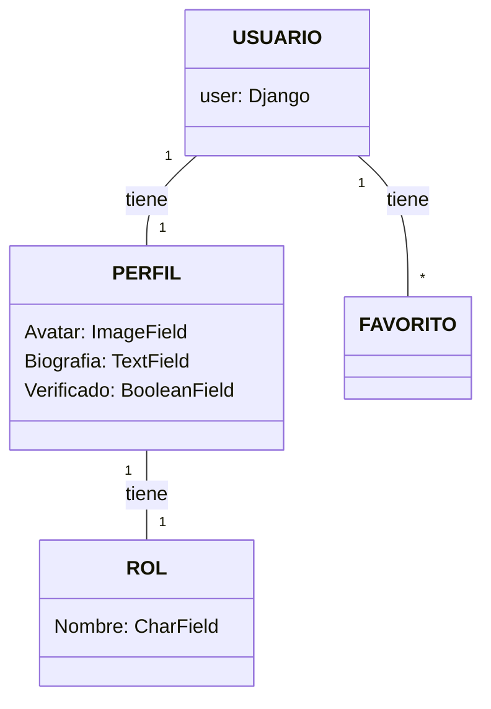

 

#### :lucide-gamepad: Juegos y Clasificación

---
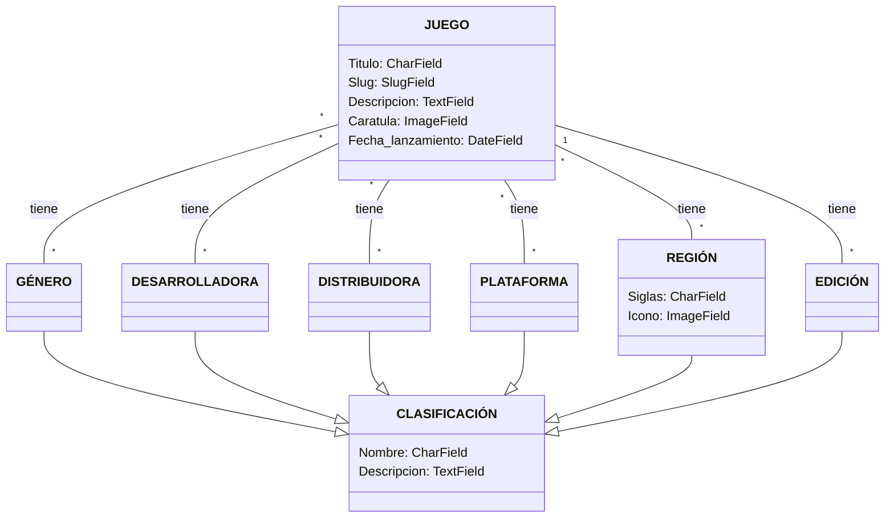

 

#### :lucide-archive: Colección, Lista de Deseos y Reviews
---

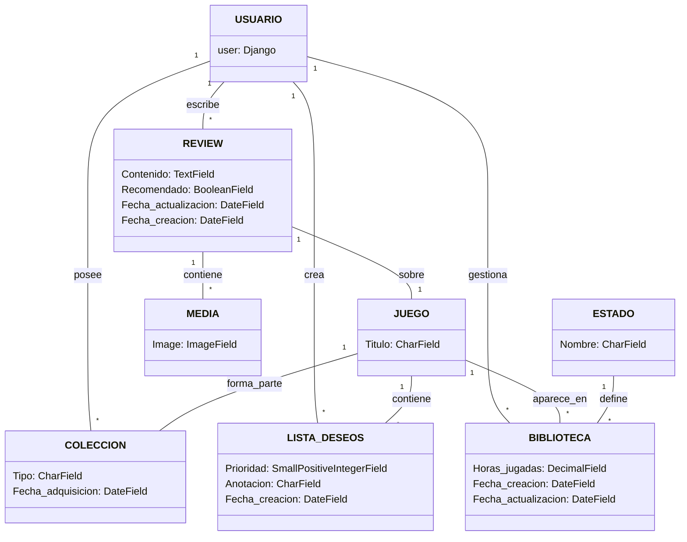

## :lucide-braces: API

### Endpoints

- `/api/admin/`: url para la vista de administración que viene por defecto en Django

- `/api/schema/`

- `/api/docs/`: url para comprobar todos los endpoints de la API mediante la librería de Swagger

- `/api/auth/`
    - POST - `/api/auth/activate/`: Envia el email de activacion si la cuenta existe.
    - POST - `/api/auth/activate/validate/`: Activa correctamente la cuenta si existe.
    - POST - `/api/auth/change-password/`: Cambia la contraseña del usuario.
    - DELETE - `/api/auth/deactivate/`: Desactiva la cuenta del usuario (soft delete).  
    - POST - `/api/auth/login/`: Hace el login.
    - POST - `/api/auth/password-reset/`: Envia el email de restablecer la contraseña.
    - POST - `/api/auth/password-reset/validate/`: Valida el restablecimiento de la contraseña.
    - POST - `/api/auth/register/`: Registra un nuevo usuario.
    - POST - `/api/auth/verify-email/`: Envia el email de verificacion del usuario.
    - POST - `/api/auth/verify-email/validate/`: Verifica correctamente la cuenta si existe.

- `/api/users/`
    - GET - `/api/users/`: Lista todos los usuarios.
    - GET - `/api/users/{id}/`: Devuelve la informacion de un usuario con la id especificada.  
    - PATCH - `/api/users/{id}/`: Actualiza la informacion de un usuario.
    - GET - `/api/users/me/`: Devuelve la informacion del propio usuario.
    - GET - `/api/users/search/`: Busca un usuario.

- `/api/games/`
    - GET - `/api/games/`: Devuelve todos los videojuegos.
    - GET - `/api/games/{id}/`: Devuelve la información de un videojuego con la id especificada.
    - PUT - `/api/games/{id}/`: Actualiza un videojuego existente.
    - DELETE - `/api/games/{id}/`: Elimina un videojuego existente.
    - GET - `/api/games/igdb/`: Devuelve los juegos de IGDB por titulo. 
    - POST - `/api/games/igdb/`: Añade los juegos de IGDB en la base de datos.
    - GET `/api/games/search/`: Busqueda de juegos con filtros.

- `/api/reviews/`
    - GET - `/api/reviews/`: Devuelve todas las reviews.
    - POST -  `/api/reviews`: Crea una nueva review.
    - GET - `/api/reviews/{id}/`: Devuelve la información de una review con la id especificada.
    - PATCH - `/api/reviews/{id}/`: Actualiza una review con la id especificada.
    - DELETE - `/api/reviews/{id}/`: Elimina una review con la id especificada.
    - POST - `/api/reviews/{id}/media/`: Añade media a una review con la id especificada.
    - DELETE - `/api/reviews/media/{id}/`: Elimina la media de una review con la id especificada.

- `/api/favorites/`
    - PATCH - `/api/favorites/{id}/`: Actualiza un favorito existente con la id especificada.
    - DELETE - `/api/favorites/{id}/`: Elimina un favorito existente con la id especificada.
    - POST - `/api/favorites/toggle/`: Alterna el estado de un favorito.
    - GET `/api/favorites/user/{id}/`: Lista todos los favoritos del usuario con la id especificada.
    - POST `/api/favorites/user/{id}/`: Añade un favorito al usuario con la id especificada.

- `/api/platforms/`
    - GET - `/api/platforms/`: Lista todas las plataformas.
    - GET - `/api/platforms/{id}/`: Devuelve la informacion de una plataforma con la id especificada.
    - PUT - `/api/platforms/{id}/`: Actualiza la plataforma con la id especificada.
    - DELETE - `/api/platforms/{id}/`: Elimina la plataforma con la id especificada.

- `/api/genres/`
    - GET - `/api/genres/`: Lista todos los géneros.
    - GET - `/api/genres/{id}/`: Devuelve la información del genero con la id especificada.
    - PUT - `/api/genres/{id}/`: Actualiza el genero con la id especificada.
    - DELETE - `/api/genres/{id}/`: Elimina el genero con la id especificada

- `/api/developers/`
    - GET - `/api/developers/`: Lista todos los desarrolladores.
    - GET - `/api/developers/{id}/`: Devuelve la información del desarrollador con la id especificada.
    - PUT - `/api/developers/{id}/`: Actualiza el desarrollador con la id especificada.
    - DELETE - `/api/developers/{id}/`: Elimina el desarrollador con la id especificada.

- `/api/publishers/`
    - GET - `/api/publishers/`: Lista todas las editoriales.
    - GET - `/api/publishers/{id}/`: Devuelve la información de la editorial con la id especificada.
    - PUT - `/api/publishers/{id}/`: Actualiza la editorial con la id especificada.
    - DELETE - `/api/publishers/{id}/`: Elimina la editorial con la id especificada.

- `/api/editions/`
    - GET - `/api/editions/`: Lista todas las ediciones.
    - POST - `/api/editions/`: Crea una nueva edicion
    - GET - `/api/editions/{id}/`: Devuelve la información de la edicion con la id especificada.
    - PUT - `/api/editions/{id}/`: Actualiza la edicion con la id especificada.
    - DELETE - `/api/editions/{id}/`: Elimina la edicion con la id especificada.

- `/api/regions/`
    - GET - `/api/regions/`: Lista todas las regiones.
    - GET - `/api/regions/{id}/`: Devuelve la informacion de la region con la id especificada.
    - PUT - `/api/regions/{id}/`: Actualiza la region con la id especificada.
    - DELETE - `/api/regions/{id}/`: Elimina la region con la id especificada.

- `/api/library/`
    - GET - `/api/library/`: Lista todas las librerias.
    - POST - `/api/library/`: Añade un videojuego a la libreria.
    - PATCH - `/api/library/`: Actualiza la libreria.
    - GET - `/api/library/{id}/`: Devuelve la informacion de un videojuego con la id especificada de la libreria.
    - PATCH - `/api/library/{id}/`: Actualiza el videojuego con la id especificada de la libreria.
    - DELETE - `/api/library/{id}/`: Elimina el videojuego con la id especificada de la libreria.
    - GET - `/api/library/user/{id}/`: Devuelve la informacion de la libreria de un usuario con la id especificada

- `/api/collections/`
    - GET - `/api/collections/`: Lista todas las colecciones.
    - POST - `/api/collections/`: Crea una coleccion.
    - POST - `/api/collections/{id}/`: Añade un videojuego a tu coleccion.
    - PATCH - `/api/collections/{id}/`: Actualiza la coleccion con la id especificada.
    - DELETE - `/api/collections/{id}/`: Elimina un videojuego de la colección
    - GET - `/api/collections/{id}/items/{id}/`: Obtiene el videojuego con una id especificada de una coleccion con tambien una id especificada.
    - PATCH - `/api/collections/{id}/items/{id}/`: Actualiza la informacion de un item con una id especificada de una coleccion con tambien una id especificada.
    - DELETE - `/api/collections/{id}/items/{id}/`: Elimina un videojuego con una id especificada de una coleccion con tambien una id especificada.
    - GET - `/api/collections/{id}/user/{id}/`: Devuelve la información de la coleccion con una id especificada de un usuario con la id tambien especificada.

- `/api/wishlists/`
    - GET - `/api/wishlist/`: Devuelve la wishlist del usuario.
    - GET - `/api/wishlist/{id}/`: Devuelve la wishlist del usuario con la id especificada.
    - POST - `/api/wishlist/{id}/`: Añade un videojuego con la id especificada a la wishlist.
    - PATCH - `/api/wishlist/{id}/`: Actualiza la informacion de la wishlist.
    - GET - `/api/wishlist/items/{id}/`: Devuelve un videojuego con la id especificada de la wishlist.
    - PATCH - `/api/wishlist/items/{id}/`: Actualiza la informacion de un videojuego con la id especificada en la wishlist.
    - DELETE - `/api/wishlist/items/{id}/`: Elimina un videojuego con la id especificada de la wishlist.

!!! info "Interacción con la API"
    Se puede interactuar con la API utilizando el Swagger. Para hacerlo, acceda a este [enlace](https://grupo10.tail647188.ts.net/api/docs/).
---

## :lucide-paintbrush: Diseño de interfaz

### Principios del diseño

### Paleta de colores

<figure markdown="span">

<figcaption class="caption-center">
Paleta de colores escogida en <a href="http://colormind.io/">ColorMind</a>
</figcaption>.

</figure>

### Vistas

#### Mapa de Navegación

El mapa de navegación fue un diseño inicial sencillo para plantear las funciones de la aplicacion web.

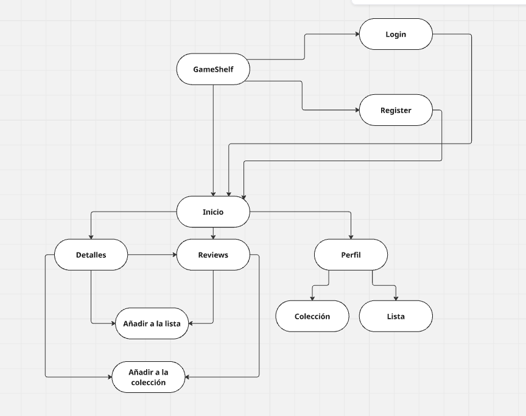

#### Sketch

En cuanto al skecth, hemos hecho un boceto a mano alzada, y ha quedado de la siguiente manera:

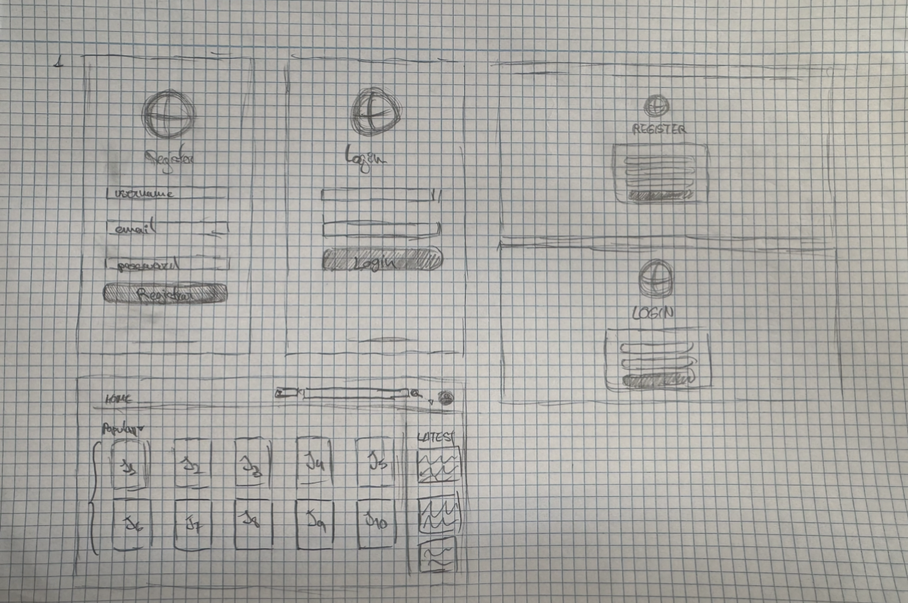

#### Wireframe

El Wireframe de la aplicación lo hemos realizado con [Moqups](moqups.com/es).

En esta etapa del diseño decidimos añadir una pantalla más que en el sketch para detallar la aplicación un poco más, así que obtenemos un total de 4 pantallas (register, login (autenticación), home y pantalla de detalles de un juego).

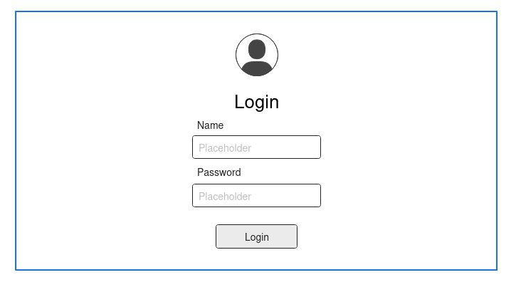

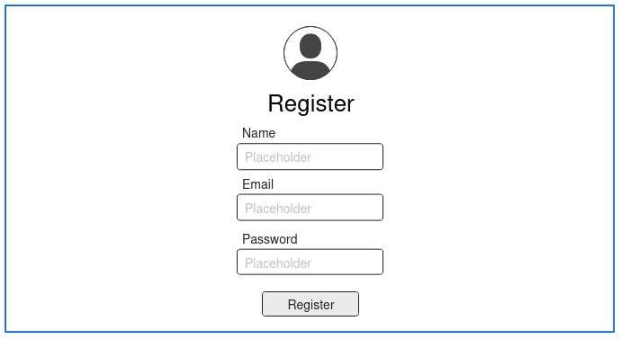

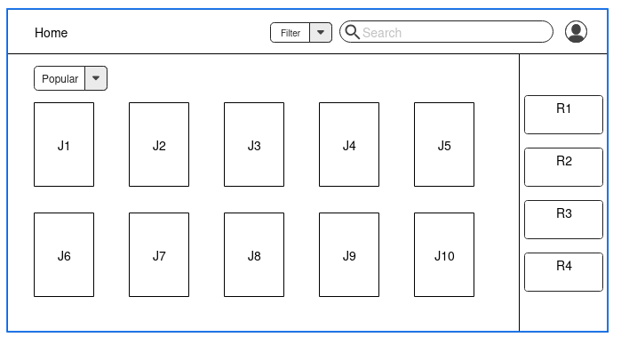

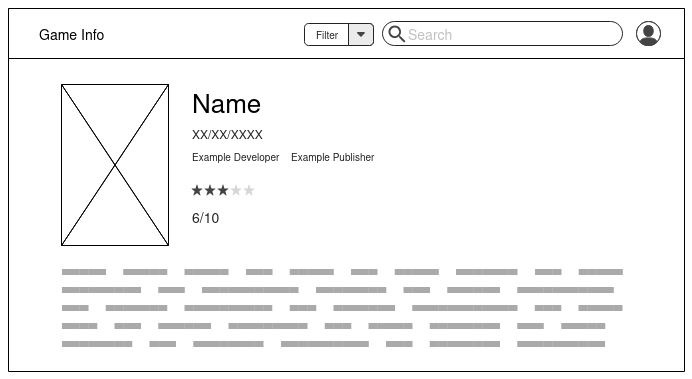

#### MockUp y Prototipo

Para llevar a cabo tanto el mockup como el prototipo hemos utilizado [Penpot](https://penpot.app/).

##### Mockup

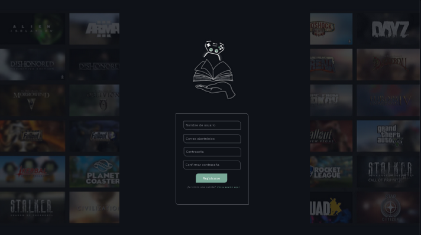

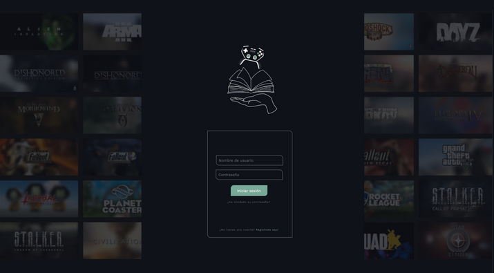

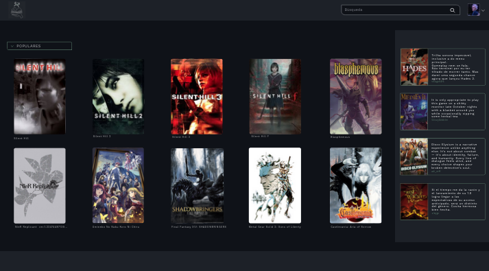

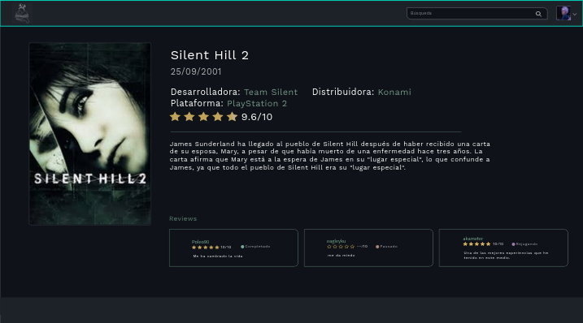

##### Prototipo

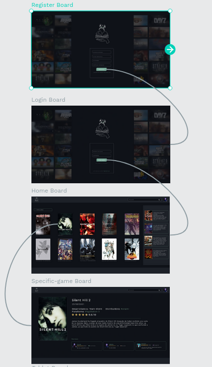