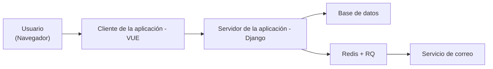
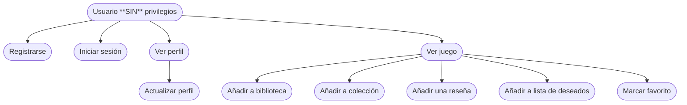
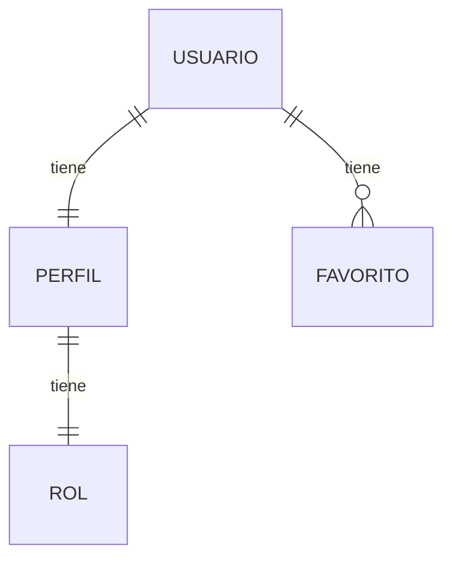
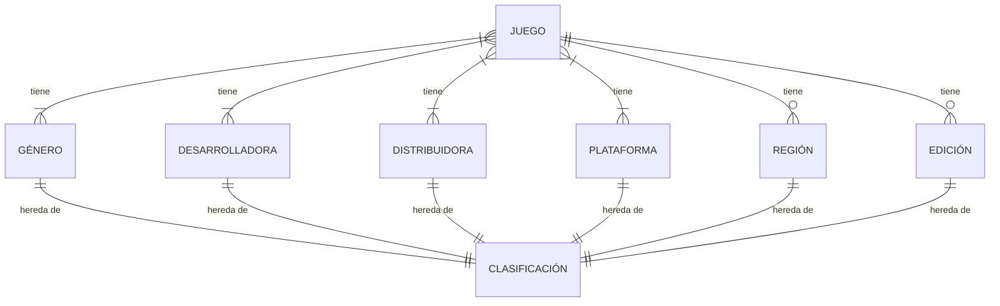
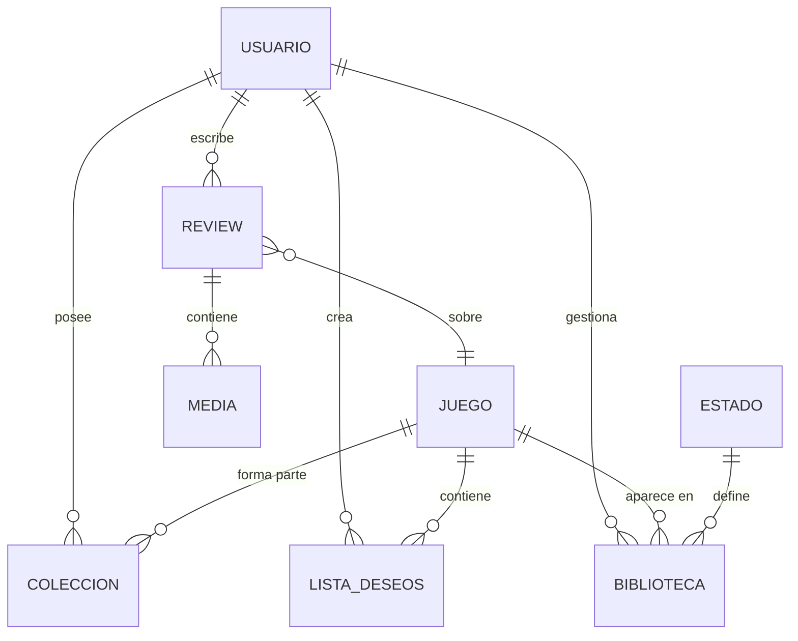
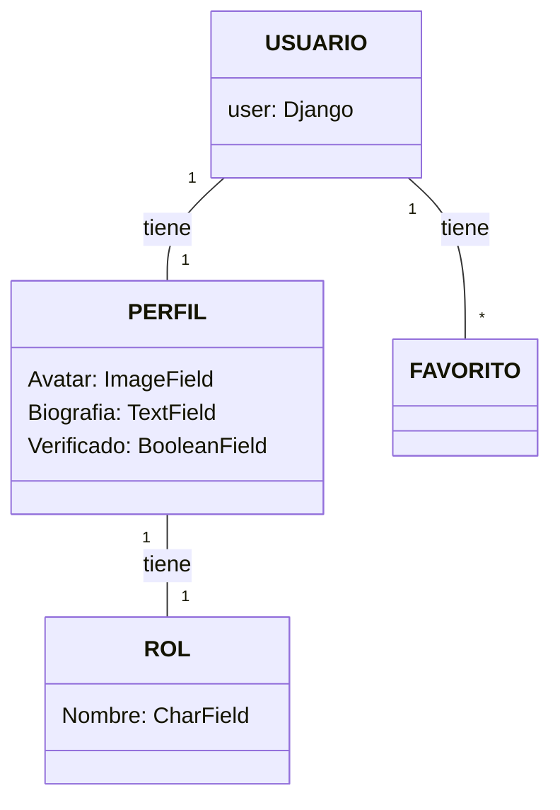
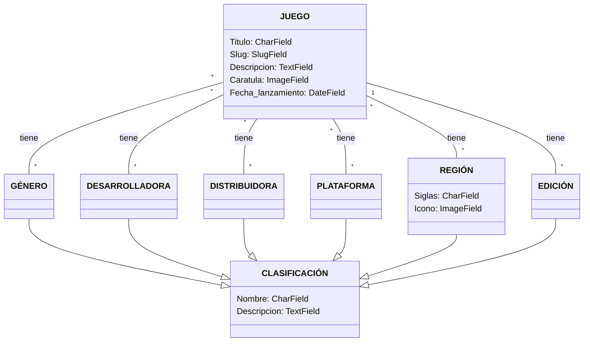
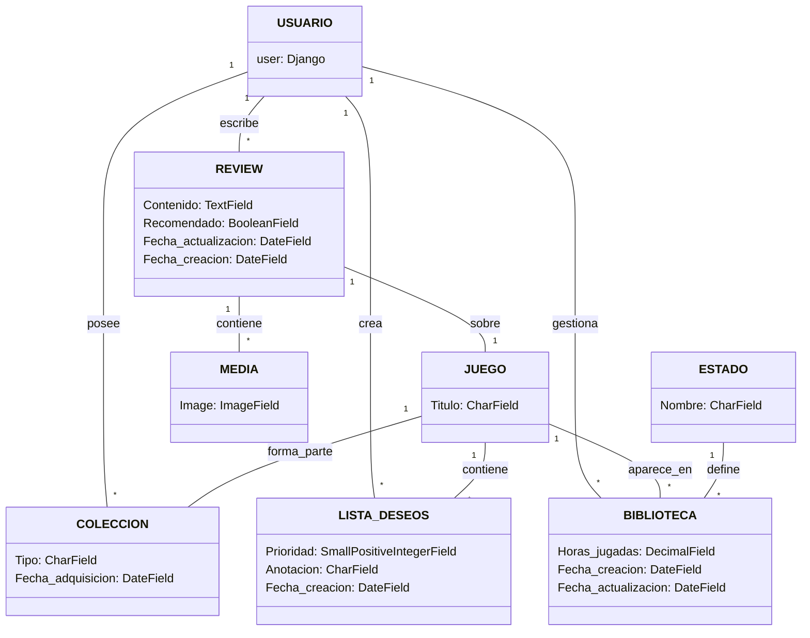

# Diseño

## :lucide-pyramid: Arquitectura del sistema

!!! success "Visión general"
    GameShelf está diseñado como una aplicación web basada en **VUE** y **Django**, siguiendo una arquitectura clara, modular y escalable.

-    :lucide-globe: **Capa de presentación**  

     ---

     Interfaz web accesible desde el navegador, construida con VUE y TailwindCSS.

-    :lucide-cpu: **Capa de aplicación**  

     ---

     Lógica de negocio implementada mediante vistas, formularios y servicios de Django.

-    :lucide-database: **Capa de datos**  

     ---

     Persistencia de información mediante Django ORM y base de datos relacional.

-    :lucide-server: **Servicios auxiliares**  

     ---

     Procesamiento en segundo plano y envío de correos mediante Redis y Django-RQ.

### Esquema general de la arquitectura

## :lucide-chart-network: Definición de la estructura del proyecto y base de datos

!!! info "División de los diagramas"
    Para facilitar la lectura y comprensión de la estructura, se optó por dividir tanto el diagrama E/R como el de clases en tres módulos principales para poder ver las relaciones principales sin saturar la visualización. 
    
    Estos módulos son los siguientes:

     * `Usuarios y perfiles` – Gestión de usuarios, perfiles, roles y favoritos.
     * `Juegos y clasificación` – Juegos, géneros, desarrolladoras, distribuidoras, plataformas, regiones y ediciones.
     * `Colección, lista de deseos y reviews` – Colecciones del usuario, listas de deseos, biblioteca y reseñas.
---

!!! warning "Consecuencias de la división"
    Esto solo afecta a la visualización de la documentación, **NO** influye en el diseño final de la aplicación.

### Diagrama de Casos de Uso

---

- :lucide-user: Registrarse
    - Actor: Usuario SIN privilegios
    - Descripción: Permite crear una cuenta en el sistema
    - Dependencias: Ninguna

- :lucide-user: Iniciar sesión
    - Actor: Usuario SIN privilegios
    - Descripción: Acceder a la cuenta creada
    - Dependencias: Ninguna

- :lucide-user: Ver perfil
    - Actor: Usuario SIN privilegios
    - Descripción: Consultar información de su perfil
    - Dependencias: Ninguna

- :lucide-user: Actualizar perfil
    - Actor: Usuario SIN privilegios
    - Descripción: Modificar sus datos personales
    - Dependencias: Depende de Ver perfil

- :lucide-gamepad: Ver juego
    - Actor: Usuario SIN privilegios
    - Descripción: Consultar la información de un juego
    - Dependencias: Ninguna

- :lucide-star: Marcar favorito
    - Actor: Usuario SIN privilegios
    - Descripción: Añadir un juego a favoritos
    - Dependencias: Depende de Ver juego

- :lucide-archive: Añadir a biblioteca
    - Actor: Usuario SIN privilegios
    - Descripción: Registrar que ha jugado/jugará el juego y sus horas jugadas
    - Dependencias: Depende de Ver juego

- :lucide-archive: Añadir a colección
    - Actor: Usuario SIN privilegios
    - Descripción: Incluir un juego dentro de su colección
    - Dependencias: Depende de Ver juego

- :lucide-edit: Añadir una reseña
    - Actor: Usuario SIN privilegios
    - Descripción: Escribir una reseña sobre un juego
    - Dependencias: Depende de Ver juego

- :lucide-edit: Editar una reseña
    - Actor: Usuario SIN privilegios
    - Descripción: Escribir una reseña sobre un juego
    - Dependencias: Depende de Añadir reseñar (_que sea del **propio usuario**_)

- :lucide-heart: Añadir a lista de deseos
    - Actor: Usuario SIN privilegios
    - Descripción: Añadir el juego a su lista de deseados
    - Dependencias: Depende de Ver juego

- :lucide-heart: Editar lista de deseos
    - Actor: Usuario SIN privilegios
    - Descripción: Añadir el juego a su lista de deseados
    - Dependencias: Depende de Añadir a lista de deseos (_que sea del **propio usuario**_)
    

---

- :lucide-gamepad: Crear juego
    - Actor: Usuario CON privilegios
    - Descripción: Crear un juego
    - Dependencias: Ninguna

- :lucide-gamepad: Editar juego
    - Actor: Usuario CON privilegios
    - Descripción: Editar un juego
    - Dependencias: Ninguna

- :lucide-gamepad: Editar juego
    - Actor: Usuario CON privilegios
    - Descripción: Editar un juego
    - Dependencias: Ninguna

### Diagrama de Entidad/Relación

#### :lucide-users: Usuarios y Perfiles
---

 

#### :lucide-gamepad: Juegos y Clasificación

---

 

#### :lucide-archive: Colección, Lista de Deseos y Reviews
---

 

### Diagrama de Clases

#### :lucide-users: Usuarios y Perfiles

 

#### :lucide-gamepad: Juegos y Clasificación

---

 

#### :lucide-archive: Colección, Lista de Deseos y Reviews
---

## :lucide-braces: API

### Endpoints

- `/api/admin/`: url para la vista de administración que viene por defecto en Django

- `/api/schema/`

- `/api/docs/`: url para comprobar todos los endpoints de la API mediante la librería de Swagger

- `/api/auth/`

- `/api/users/`

- `/api/games/`
    - `/api/games/`: listado de todos los videojuegos
    - `/api/games/add/`: añadir uno videojuego nuevo
    - `/api/games/<int:pk_game>/edit/`: edita un videojuego existente
    - `/api/games/<int:pk_game>/delete/`: borra un videojuego existente

- `/api/reviews/`
    - `/api/reviews/`: listado de todas las reviews
    - `/api/reviews/add/`: añadir una review nueva
    - `/api/reviews/<int:pk_review>/edit/`: edita una review existente
    - `/api/reviews/<int:pk_review>/delete/`: borra una review existente

- `/api/medias/`
    - `/api/medias/`: listado de todas las medias
    - `/api/medias/add/`: añadir una media nueva
    - `/api/medias/<int:pk_media>/edit/`: edita una media existente
    - `/api/medias/<int:pk_media>/delete/`: borra una media existente

- `/api/favorites/`
    - `/api/favorites/`: listado de todos los favoritos
    - `/api/favorites/add/`: añadir un favorito nuevo
    - `/api/favorites/self-add/`: añadir un favorito a la lista del propio usuario
    - `/api/favorites/<int:pk_favorite>/edit/`: edita un favorito existente
    - `/api/favorites/<int:pk_favorite>/delete/`: borra un favorito existente

- `/api/platforms/`
    - `/api/platforms/`: listado de todas las plataformas
    - `/api/platforms/add/`: añadir una plataforma nueva
    - `/api/platforms/<int:pk_platform>/edit/`: edita una plataforma existente
    - `/api/platforms/<int:pk_platform>/delete/`: borra una plataforma existente

- `/api/genres/`
    - `/api/genres/`: listado de todos los géneros de videojuegos
    - `/api/genres/add/`: añadir un género de videojuego
    - `/api/genres/<int:pk_genre>/edit/`: edita un género existente
    - `/api/genres/<int:pk_genre>/delete/`: borra un género existente

- `/api/developers/`
    - `/api/developers/`
    - `/api/developers/`: listado de todos los desarrolladores de videojuegos
    - `/api/developers/add/`: añadir un desarrolladores de videojuegos
    - `/api/developers/<int:pk_developer>/edit/`: edita un desarrollador existente
    - `/api/developers/<int:pk_developer>/delete/`: borra un desarrollador existente

- `/api/publishers/`
    - `/api/publishers/`
    - `/api/publishers/`: listado de todos los publishers de videojuegos
    - `/api/publishers/add/`: añadir un publishers de videojuegos
    - `/api/publishers/<int:pk_publisher>/edit/`: edita un publishers existente
    - `/api/publishers/<int:pk_publisher>/delete/`: borra un publishers existente

- `/api/editions/`
    - `/api/editions/`
    - `/api/editions/`: listado de todas las ediciones de videojuegos
    - `/api/editions/add/`: añadir una edición de videojuego
    - `/api/editions/<int:pk_edition>/edit/`: edita una edición existente
    - `/api/editions/<int:pk_edition>/delete/`: borra una edición existente

- `/api/regions/`
    - `/api/regions/`
    - `/api/regions/`: listado de todas las regiones de videojuegos
    - `/api/regions/add/`: añadir una region de videojuego
    - `/api/regions/<int:pk_region>/edit/`: edita una region existente
    - `/api/regions/<int:pk_region>/delete/`: borra una region existente

- `/api/libraries/`
    - `/api/libraries/`
    - `/api/libraries/`: listado de todos los item de bibliotecas
    - `/api/libraries/add/`: añadir un item de bibliotecas
    - `/api/libraries/<int:pk_library_item>/edit/`: edita un item de bibliotecas
    - `/api/libraries/<int:pk_library_item>/delete/`: borra un item de bibliotecas

- `/api/collections/`
    - `/api/collections/`
    - `/api/collections/`: listado de todos los items de colección
    - `/api/collections/add/`: añadir un item de colección
    - `/api/collections/self-add/`: añadir un item a la colección del propio usuario
    - `/api/collections/<int:pk_collection_item>/edit/`: editar un item de colección
    - `/api/collections/<int:pk_collection_item>/delete/`: borra un item de colección

- `/api/wishlists/`
    - `/api/wishlists/`
    - `/api/wishlists/`: listado de todos los items de wishlists
    - `/api/wishlists/add/`: añadir un item de wishlist
    - `/api/wishlists/self-add/`: añadir un item a la wishlist del propio usuario
    - `/api/wishlists/<int:pk_wishlist_item>/edit/`: editar un item de wishlist
    - `/api/wishlists/<int:pk_wishlist_item>/delete/`: borra un item de wishlist

!!! info "Interacción con la API"
    Se puede interactuar con la API utilizando el Swagger. Para hacerlo, acceda a este [enlace]().
---

## :lucide-paintbrush: Diseño de interfaz

### Principios del diseño

### Paleta de colores

<figure markdown="span">

<<<<<<< HEAD
<figcaption class="caption-center">
Paleta de colores escogida en <a href="http://colormind.io/">ColorMind</a>
</figcaption>.
=======
  <figcaption>
    Paleta de colores creada utilizando <a href="http://colormind.io/">ColorMind</a>.
  </figcaption>
>>>>>>> gs#2

</figure>

### Vistas

#### Mapa de Navegación

El mapa de navegación fue un diseño inicial sencillo para plantear las funciones de la aplicacion web.

#### Sketch

En cuanto al skecth, hemos hecho un boceto a mano alzada, y ha quedado de la siguiente manera:

#### Wireframe

El Wireframe de la aplicación lo hemos realizado con [Moqups](moqups.com/es).

En esta etapa del diseño decidimos añadir una pantalla más que en el sketch para detallar la aplicación un poco más, así que obtenemos un total de 4 pantallas (register, login (autenticación), home y pantalla de detalles de un juego).

#### MockUp y Prototipo

Para llevar a cabo tanto el mockup como el prototipo hemos utilizado [Penpot](https://penpot.app/).

##### Mockup

##### Prototipo

