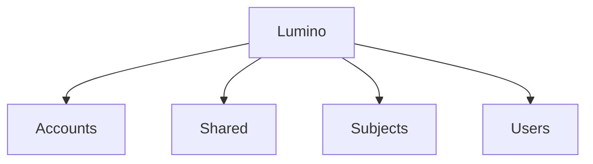
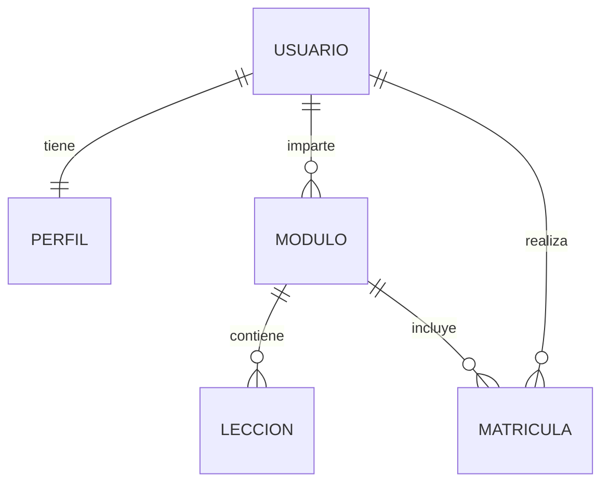

# Diseño del sistema

## Arquitectura del sistema

En cuanto al diseño del sistema, este se basa en las siguientes aplicaciones:

| Aplicación  | Utilidad  |  
|---|---|
| Accounts | Artefactos compartidos.  | 
| Shared | Gestión de autenticación.  | 
| Subjects | Gestión de módulos (materias) y unidades (temas).  |   
| Users | Gestión de usuarios.  |   

Creando así la siguiente estructura en Lumino:

<div align="center">

</div>

## Modelo de datos

Por parte del modelo de datos, tenemos que las entidades tienen las siguientes relaciones entre ellas:

<div align="center">


</div>

## Diagramas

### Diagrama de clases

<div align="center">
    ```mermaid
    classDiagram
        class User {
            <<Django>>
        }

        class Profile {
            +Enum role
            +Image avatar
            +String bio
        }

        class Subject {
            +String code
            +String name
        }

        class Lesson {
            +String title
            +String content
        }

        class Enrollment {
            +Date enrolled_at
            +Integer mark
        }

        %% Relationships
        User "1" --> "1" Profile : has
        User "1" --> "0..*" Subject : teaches
        Subject "1" --> "0..*" Lesson : contains
        User "1" --> "0..*" Enrollment : student
        Subject "1" --> "0..*" Enrollment : subject
    ```
</div>

### Diagrama de secuencia

<div align="center">
    ```mermaid
    sequenceDiagram
        actor Student
        participant View as Django View
        participant System as Lumino System
        participant DB as Database

        Student ->> View: Request enrollment page
        View ->> System: Load available subjects
        System ->> DB: Query subjects not enrolled
        DB -->> System: Subjects list
        System -->> View: Subjects list
        View -->> Student: Show enrollment form

        Student ->> View: Submit enrollment form
        View ->> System: Enroll student
        System ->> DB: Create Enrollment
        DB -->> System: Enrollment saved
        System -->> View: Success message
        View -->> Student: Redirect to subjects list
    ```
</div>


## Decisiones de diseño

Las decisiones de diseño adoptadas en el desarrollo de **Lumino** se han tomado con el objetivo de garantizar la claridad, mantenibilidad y escalabilidad de la aplicación, siguiendo las buenas prácticas recomendadas para el desarrollo de aplicaciones web con Django.

### Patrones y enfoques de diseño

- Se sigue el patrón **MVT (Model–View–Template)** propio de Django, separando la lógica de negocio, la presentación y el acceso a datos.
- Se utiliza el patrón **Many-to-Many con entidad intermedia** mediante el modelo *Enrollment*, lo que permite almacenar información adicional como la fecha de matriculación y la calificación.
- Se aplica **control de acceso basado en roles**, diferenciando entre alumnado y profesorado a través del campo `role` del perfil de usuario.
- Se hace uso de **formularios basados en modelos** para reducir duplicidad de código y facilitar la validación de datos.
- Se emplean **señales de Django** para automatizar la creación del perfil de usuario tras el registro.
- Se utilizan **tareas asíncronas** para operaciones costosas como la generación y envío de certificados en PDF.

