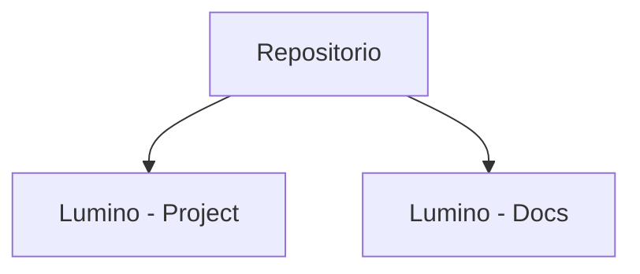

# Implementación

## Estructura del código

El código del proyecto **Lumino** se organiza siguiendo las convenciones y buenas prácticas recomendadas por el framework Django, con el objetivo de facilitar la comprensión, el mantenimiento y la escalabilidad de la aplicación.

### Organización del repositorio

El repositorio presenta una diferenciación entre el proyecto en django y la documentación. 

<div align="center">


</div>

Comenzaremos con la estructra del proyecto Django, la cual es modular, donde cada funcionalidad principal se encuentra separada en una aplicación independiente:

- **main/**: contiene la configuración principal del proyecto Django, incluyendo ajustes globales, URLs y configuración de idioma, zona horaria y archivos estáticos.
- **shared/**: agrupa elementos comunes reutilizables por el resto de aplicaciones, como vistas genéricas o utilidades compartidas.
- **accounts/**: gestiona la autenticación de usuarios, incluyendo inicio y cierre de sesión así como el registro.
- **subjects/**: contiene la lógica relacionada con los módulos formativos, lecciones, matriculación y calificaciones.
- **users/**: gestiona los perfiles de usuario y la información asociada a cada cuenta.

<div align="center">

  ```mermaid
    flowchart TD
      Project[Lumino - Project]

      Project --> main[main/]
      Project --> shared[shared/]
      Project --> accounts[accounts/]
      Project --> subjects[subjects/]
      Project --> users[users/]
  ```
</div>

---

Por parte de la estructura de la documentación tenemos:

- **docs/**: alberga la documentación del proyecto generada con MkDocs.
    - **stylesheets/**: contiene los estilos personalizados de la documentación.
    - **assets/**: contiene los contenidos multimedia personalizados de la documentación.

<div align="center">
  ```mermaid
    graph TD
      Root[Lumino - Docs]
      Docs[docs/]
      
      Root --> Docs[docs/]
      Docs --> Styles[stylesheets/]
      Docs --> Assets[assets/]
  ```
</div>

---

### Convenciones utilizadas

Durante el desarrollo del proyecto se han seguido las siguientes convenciones para contribuir a un código limpio, coherente y fácil de mantener:

- Uso de **nombres descriptivos** para archivos, clases y funciones, facilitando la legibilidad del código.
- Separación clara entre **modelos, vistas y plantillas**, siguiendo el patrón MVT de Django.
- Uso de **plantillas base** e inclusión de componentes reutilizables para evitar duplicación de código.
- Organización de las URLs por aplicación, mejorando la claridad y el mantenimiento.
- Uso de **formularios basados en modelos** siempre que ha sido posible.
- Aplicación de **control de acceso** mediante decoradores y comprobaciones de rol.
- Uso de **Git** como sistema de control de versiones, manteniendo un historial claro de cambios.

## Tecnologı́as y herramientas

En el desarrollo del proyecto **Lumino** se han utilizado diversas tecnologías y herramientas que permiten la creación de una aplicación web robusta, mantenible y escalable.

### Lenguajes de programación

- **Python**: lenguaje principal del proyecto, utilizado para la lógica de negocio y el desarrollo del backend.
- **HTML5 y CSS3**: empleados para la estructura y el diseño de la interfaz de usuario.
- **Markdown**: utilizado para la documentación del proyecto y la creación de contenidos.

### Frameworks
- **Django**: framework web utilizado para el desarrollo de la aplicación, proporcionando una arquitectura clara, seguridad integrada y herramientas para la gestión de usuarios, formularios y bases de datos.
- **Bootstrap**: empleado para el diseño de la interfaz, permitiendo un diseño responsive y coherente.

### Bibliotecas y herramientas adicionales
- **Django-RQ**: utilizado para la gestión de tareas asíncronas, como la generación y envío de certificados en formato PDF.
- **Redis**: sistema de almacenamiento en memoria empleado como backend para la cola de tareas.
- **Pillow**: para el manejo de imágenes.
- **Sorl Thumbnail**: biblioteca utilizada para la generación de miniaturas de imágenes de perfil.
- **Django-Markdownify**: para el convertir markdown a HTML en las plantillas.
- **Prettyconf**: para el gestión de las credenciales para el envió de correo electrónico.

- **Just**: herramienta para la automatización de comandos y tareas habituales del proyecto.
- **uv**: gestor de dependencias y entornos virtuales para Python.
### Entorno de desarrollo
- **Entorno virtual (.venv)**: utilizado para aislar las dependencias del proyecto.
- **Base de datos SQLite**: empleada durante el desarrollo por su simplicidad y facilidad de configuración.
- **MkDocs con ZenSical**: utilizado para la documentación del proyecto, facilitando una presentación clara y navegable.
- **Git**: sistema de control de versiones utilizado para el seguimiento de cambios y trabajo colaborativo.

## Instrucciones de configuración

Se proporciona un archivo justfile con la siguiente receta:


```bash
j setup
```


<details class="info">
  <summary>¿Qué hemos hecho?</summary>

  <ul>
    <li>Se ha creado un entorno virtual en la carpeta <code>.venv</code>.</li>
    <li>Se han instalado las dependencias del proyecto.</li>
    <li>Se ha creado un proyecto Django en la carpeta <code>main</code>.</li>
    <li>Se han aplicado las migraciones iniciales del proyecto.</li>
    <li>Se ha creado un superusuario con credenciales: <strong>admin</strong> - <strong>admin</strong>.</li>
    <li>Se ha establecido el <em>timezone</em> a <code>Atlantic/Canary</code> en <code>settings.py</code>.</li>
    <li>Se han establecido las configuraciones de media en <code>settings.py</code>.</li>
  </ul>

</details>
